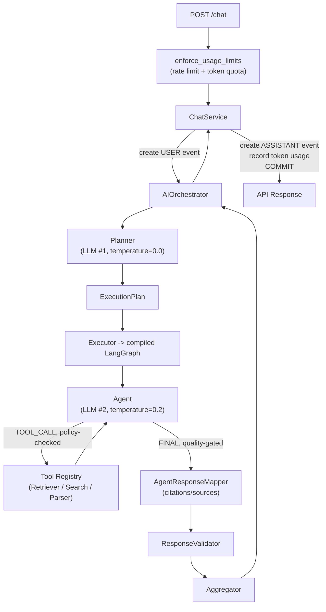

# ⚖️ Juris AI

Juris-AI is an AI-powered legal assistant built around explicit,
LangGraph-based agent execution and provider-independent LLM
infrastructure — planning, execution, reasoning, external actions,
persistence, and API concerns are kept in separate layers so the
system can grow from a small multi-agent app into a multi-agent,
multi-provider legal platform.

## Architecture


Full diagrams and design rationale: [`docs/architecture/overview.md`](docs/architecture/overview.md).
Current, real (not aspirational) module behavior:
[`src/agentic/README.md`](src/agentic/README.md) ·
[`src/rag/README.md`](src/rag/README.md).

## What's actually true today

Stated plainly, not aspirationally — verified against the code and,
where numeric, against a live run on 2026-09-13:

- **RAG retrieval works.** Live evaluation against the golden
  dataset (29 cases, `scripts/python/evaluate_rag_retrieval.py`): **22/29
  passed (75.86% pass rate)**, `recall@5=0.759`, `precision@5=0.152`,
  `mrr@5=0.602`. 7 failures share one pattern (expected evidence never
  in the top 5) — see `src/rag/README.md` for detail.
- **Agent tool-permission enforcement is live.** `agent_policies` is
  a real, seeded DB table (previously a static, empty dict that made
  every real agent execution crash outright). Both LLM-proposed and
  system-forced tool calls are checked.
- **Per-user rate limiting and daily token quota exist** on
  `POST /chat` (fixed-window request-rate limit + token quota, 429 on
  breach).
- **`POST /chat/stream` is broken.** `ChatService.stream_chat()`
  calls `AIOrchestrator.stream()`, which does not exist — every real
  request to this endpoint raises `AttributeError` server-side. Known,
  not yet fixed; rate limiting still applies to it regardless (it's
  broken, not a quota bypass). See `src/agentic/README.md` → Known
  gaps.
- Only **Groq** and a **local Ollama model** (Qwen3, 32K context)
  are actually wired up today — the LLM provider abstraction supports
  more, but OpenAI/Anthropic have no concrete client yet.

For the full, current list of open gaps (with owners), see `claude.md`
→ Known gaps.

## Execution Strategies

Juris-AI supports three explicit execution strategies, derived
structurally from each execution step's `depends_on` graph (not a
mode switch the Executor reads — see `src/agentic/README.md`):

### Sequential

```text
Step A -> Step B -> Step C
```

### Parallel

```text
          ExecutionPlan
               │
        ┌──────┼──────┐
        ▼      ▼      ▼
      Agent A Agent B Agent C
        │      │      │
        └──────┼──────┘
               ▼
           Aggregator
```

### Hybrid

```text
Step A -> Step B -> ┬─ Step C ─┐
                     └─ Step D ─┴─> Step E
```

---

# ✨ Features

- AI-powered legal assistant (Legal, Contract agents)
- LangGraph-based execution graph, derived from explicit step dependencies
- LLM-based execution planning, provider-independent LLM abstraction
- Hybrid (vector + keyword) retrieval with RRF fusion and cross-encoder reranking
- Document retrieval, upload parsing (PDF/DOCX/text/Markdown), and web search
- Prompt-injection screening on ingested, fetched, and uploaded content
- Per-user rate limiting and daily token quota
- Conversation memory: rolling cross-conversation summarization
- Conversation and event persistence
- User registration and authentication
- FastAPI REST APIs with OpenAPI documentation
- Secure password hashing using Argon2 (`pwdlib`)
- PostgreSQL + pgvector, SQLAlchemy 2.x, Alembic migrations
- Environment-based configuration using Pydantic Settings
- Docker and Docker Compose support
- Automated testing, linting, formatting, and CI/CD

---

# 🚀 Quick Start

## Clone the repository

```bash
git clone <repository-url>
cd juris-ai
```

## Set up commit signing (required for PRs)

Both `develop` and `main` require every commit to be signed before it
can merge. Set this up now, before your first commit — see
[`docs/setup/commit-signing.md`](docs/setup/commit-signing.md).

## Create a virtual environment

```bash
python -m venv .venv
source .venv/bin/activate
```

## Install System Dependency

```bash
make bootstrap
```

## Install dependencies

```bash
poetry install
```

## Configure environment

```bash
cp env.example .env
```

Update the required values in `.env` — at minimum `SECRET_KEY`,
`JWT_SECRET_KEY`, `DB_*`, and `GROQ_API_KEY`. Rate limiting, the
`legal` agent's web-research grant, and the faithfulness-evaluation
backend all have working defaults but are worth reviewing — see the
comments in `env.example`.

## Start the application

```bash
make dev-deploy
```

## Set up local DB role separation

The app connects to Postgres as a restricted, non-superuser role
(`APP_DB_USER`/`APP_DB_PASSWORD` in `.env`) distinct from the
admin/migration role (`DB_USER`/`DB_PASSWORD`) that owns the schema
and runs migrations. A fresh Postgres container creates this role
automatically on first boot, but **if your local Postgres volume
already existed before this**, run it explicitly once (safe to
re-run any time):

```bash
make db-setup-role
```

Do this *before* `make alembic-upgrade` below — one migration
restricts this role's access to a specific table, which requires the
role to already exist.

## Run database migrations

```bash
make alembic-upgrade
```

The API will be available at:

- Swagger UI: http://localhost:8001/docs
- ReDoc: http://localhost:8001/redoc

Observability containers:

- Grafana: http://localhost:3000
- Prometheus: http://localhost:9090

For Grafana, the default login is typically `admin` / `admin` unless
you configured credentials through `.env` or the Compose file.

---

# 📂 Project Structure

```text
src/
├── api/                # HTTP layer: routes, auth, validation, SSE -- no AI logic
├── application/         # Services (chat, conversation, auth), authorization (RBAC, capability, approval)
├── agentic/             # Planning, orchestration, execution, agents, tools -- see src/agentic/README.md
├── rag/                 # Ingestion, indexing, hybrid retrieval, evaluation -- see src/rag/README.md
├── adapters/            # External I/O: DB (SQLAlchemy), LLM/MCP/search/storage clients, security, observability
├── core/                # DTOs, exceptions, enums, shared models -- no dependency on any layer above
├── wiring/              # Dependency-injection composition root and factories
└── main.py              # Application entry point
```

This replaces an older, flatter layout (`agents/`, `services/`,
`repositories/`, `tools/`, etc. all directly under `src/`) — the
current structure groups by architectural layer instead. See
`claude.md`'s Layer map for the dependency rule between these
(`core/` must never import from anything above it).

---

# 🛠 Technology Stack

| Layer              | Technology              |
| ------------------ | ----------------------- |
| Language           | Python 3.11+            |
| Framework          | FastAPI                 |
| ASGI Server        | Uvicorn                 |
| Database           | PostgreSQL + pgvector   |
| ORM                | SQLAlchemy 2.x          |
| Database Migration | Alembic                 |
| Validation         | Pydantic v2              |
| Authentication     | pwdlib (Argon2)         |
| Agent execution    | LangGraph               |
| AI Providers       | Groq (primary), Ollama/local (Qwen3) |
| Containerization   | Docker & Docker Compose |
| Code Quality       | Ruff, MyPy, Pre-commit  |
| Testing            | Pytest                  |

---

# 🔄 Request Lifecycle

For a normal chat request (`POST /chat`) — the real graph-based path,
not the `BaseAgent.run()`/`stream()` methods (dead code, see
`src/agentic/README.md`):



Full detail, including the FINAL quality gate's two remedy branches
and the rate-limiting sequence: `src/agentic/README.md`.

---

# 🧩 Responsibility Matrix

| Component                    | Owns                                   | Must NOT Own            |
| ---------------------------- | --------------------------------------- | ----------------------- |
| **FastAPI**                  | HTTP, authentication, validation, SSE  | AI logic                |
| **ChatService**              | Conversation lifecycle, DB transaction | Planning                |
| **AIOrchestrator**           | AI lifecycle coordination              | Agent execution         |
| **Planner**                  | Intent and `ExecutionPlan`             | Actual execution        |
| **Executor**                 | Plan execution (via LangGraph)         | Planning/reasoning      |
| **Agent**                    | Domain reasoning                       | Infrastructure          |
| **Tool**                     | External actions                       | Domain reasoning        |
| **AgentPolicyGuard**         | Tool-call authorization                | Tool execution          |
| **Agent Registry**           | Agent lookup                           | Agent execution         |
| **Tool Registry**            | Tool lookup                            | Tool execution          |
| **LLM client abstraction**   | Provider translation                   | Business logic          |
| **Aggregator**               | Merge outputs/provenance               | Planning                |
| **AnswerQualityPolicy**      | Gate FINAL answers                     | Answer generation       |
| **UsageService**             | Rate limit + token quota               | Chat business logic     |
| **ConversationEventService** | DB event persistence                   | AI execution            |
| **Observability**            | Logs, traces, metrics                  | Business decisions      |

---

# 📚 Documentation

| Document | Description |
| --- | --- |
| [`docs/README.md`](docs/README.md) | Development guide (Makefile-driven workflow, environments, troubleshooting) |
| [`docs/architecture/overview.md`](docs/architecture/overview.md) | System architecture — intended design, with status callouts marking known divergences |
| [`docs/architecture/api.md`](docs/architecture/api.md) | REST API reference |
| [`src/agentic/README.md`](src/agentic/README.md) | Real current behavior: planning, orchestration, execution, agents, tools |
| [`src/rag/README.md`](src/rag/README.md) | Real current behavior: ingestion, indexing, retrieval, evaluation |
| [`claude.md`](claude.md) | Repo-wide working conventions and the authoritative Known-gaps list |

---

# 👨‍💻 Maintainer

**Bharat Kumar**

Senior Software Engineer | Backend & Cloud

📧 `kumar.bhart28@gmail.com`

🔗 [LinkedIn](https://www.linkedin.com/in/bharat-kumar28)

---

# 📄 License

This project is licensed under the **GNU Affero General Public License v3.0 (AGPL-3.0-only)**. See the `LICENSE` file for the full text.

Need to keep your modifications or hosted offering proprietary? See [legal/COMMERCIAL-LICENSE.md](legal/COMMERCIAL-LICENSE.md) for commercial licensing options.

### Licensing FAQ for self-hosters

- **Running Juris AI unmodified (including as a network service)?** No obligation to disclose or publish anything. Use it privately or in your org with no source-sharing requirement.
- **Modified it for internal use only, never exposed to outside users?** Still no disclosure obligation — the AGPL's network-use clause (§13) only triggers when other users interact with your modified version over a network.
- **Modified it *and* let others interact with your modified version over a network** (e.g. offering it as a hosted service to customers or the public)? You must make the Corresponding Source of your modified version available to those users, per AGPL-3.0 §13.
- **Just want to use it as a dependency/library in a separate proprietary project without networked interaction with it?** Talk to a lawyer — AGPL's copyleft can still reach combined/derivative works; this FAQ is not legal advice.
