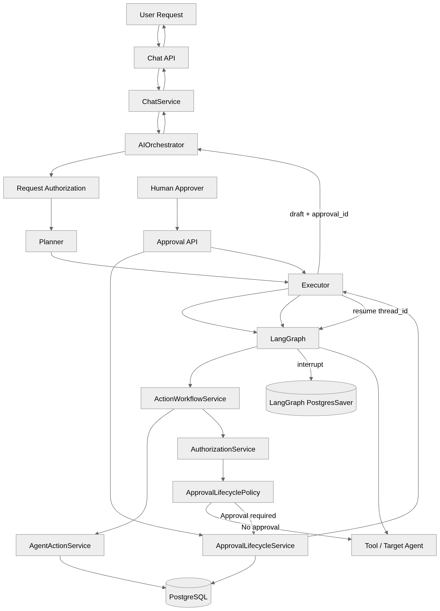

# ⚖️ Juris AI

AI-powered legal assistant for Indian law — multi-agent reasoning, hybrid RAG retrieval, self-hostable.

[](LICENSE)
[](https://github.com/bharatkse/juris-ai/actions/workflows/ci-server.yml)


## Capabilities

- **Hybrid RAG retrieval** — vector + keyword search fused via Reciprocal Rank Fusion, then cross-encoder reranked
- **Policy-gated agent/tool architecture** — every tool call, LLM-proposed or system-forced, checked against a seeded, DB-backed permission policy before it runs
- **Human-in-the-loop approval** — gated tools (email, Slack) pause execution via LangGraph's `interrupt()`/resume instead of running immediately; verified end-to-end against a real Postgres checkpointer
- **PII redaction + harmful-content guardrails** — Presidio-based, with custom Indian-identifier recognizers, on every generated response
- **Immutable compliance audit logging** — DB-trigger-enforced, independent of conversation history
- **Per-user rate limiting and daily token quotas**
- **Real-time response streaming** — guardrail-aware: content that gets redacted or blocked is never streamed, only the corrected final answer is
- **AWS deployment** — via Terraform (parity-tested against a local Floci emulator) or AWS SAM/CloudFormation

## 🚀 Quick Start

```bash
git clone https://github.com/bharatkse/juris-ai.git && cd juris-ai
./install.sh
```

First run builds the image locally (a few minutes) — this will switch to a fast image pull once the first versioned release is published. `install.sh` generates real secrets, prompts only for your `GROQ_API_KEY` ([get one here](https://console.groq.com/keys)), and waits for a real health check before printing the URL.

- Swagger UI: http://localhost:8001/docs

## Deployment Tiers

| Tier | What | Best for |
| --- | --- | --- |
| **1 — `install.sh`** (Quick Start above) | Auto-generates secrets, prompts only for `GROQ_API_KEY`, waits for a real health check | Just want it running |
| **2 — Manual `docker compose`** | `cp env.example .env`, fill in every value yourself, then `docker compose up -d --build` | Full control over configuration, or scripting your own install |

Developer setup (running from source, tests) or a cloud deploy (Terraform/AWS SAM)? See [`docs/server/`](docs/server/).

## Architecture

FastAPI serves the HTTP/SSE layer. A LangGraph-compiled graph drives multi-agent execution: a **Planner** LLM call produces an `ExecutionPlan`, an **Executor** runs it (sequential/parallel/hybrid, derived structurally from step dependencies), each **Agent** reasons and proposes tool calls, and every tool call — LLM-proposed or system-forced — is checked against a seeded, DB-backed permission policy before the **Tool Registry** dispatches it to a retrieval, search, or parsing tool. Retrieval is hybrid: vector + keyword search fused with Reciprocal Rank Fusion, then cross-encoder reranked. Every response, streamed or not, passes through a guardrails layer (PII redaction, harmful-content review) before reaching the client, and an immutable compliance log records the request/decision trail independently of conversation history.



Full diagrams and current implementation status: [`docs/server/architecture/overview.md`](docs/server/architecture/overview.md).

## Repository Map

```text
juris-ai/
├── server/            # FastAPI backend -- source, tests, Makefile-driven dev workflow
├── clients/           # Reserved for future first-party client apps (none yet)
├── docker/
│   ├── server/         # Backend Docker Compose stacks (dev, local AWS emulation, observability)
│   └── clients/        # Reserved for future client Docker assets (none yet)
├── docs/
│   ├── server/         # Backend architecture, setup guides, API reference
│   └── clients/        # Reserved for future client docs (none yet)
├── iac/
│   ├── terraform/      # Multi-cloud IaC (AWS built and parity-tested; GCP/Azure are stubs)
│   └── cloud/          # AWS SAM/CloudFormation templates (original deploy path)
├── legal/              # Commercial licensing terms
├── docker-compose.yml   # Release bundle: run Juris AI (builds from source until first GHCR publish)
├── install.sh           # Release-flow installer -- see Quick Start above
├── env.example          # Release-flow configuration template
└── claude.md            # Working conventions and the authoritative Known-gaps list
```

## Data Processing & Privacy

Describes what the code actually does — not a legal privacy policy. If you deploy this for others, you own your own compliance obligations.

| What | Detail |
| --- | --- |
| LLM inference | **Groq** (`GROQ_API_KEY`) — chat messages + retrieved context, always on |
| Web search | **Brave Search** — only when the web-research tool runs |
| Tracing | **LangSmith** — off by default; can include conversation content if enabled |
| PII redaction | Presidio-based, on generated output only; custom `IN_PAN`/`IN_AADHAAR` recognizers |
| Local data | Legal corpus (`raw_datasets/`) is local public-domain text; local Ollama model runs on your own infra |
| Retention | No automatic deletion — conversations/events persist in Postgres until you remove them |

## Audit Status

| Area | Status |
| --- | --- |
| Compliance logging | Real, DB-trigger-enforced immutability on `compliance_log` — verified by e2e tests against a real Postgres instance |
| Security | `python-jose` transitive-dependency gap found and fixed; verified end-to-end (login, JWT validation, tampered-token rejection) |
| Streaming | `POST /chat/stream` works — guardrail-aware (redacted/blocked content is never streamed) — verified by e2e tests |
| Known production gaps | No real `ENVIRONMENT=production` path · `DB_SECRET_ARN` unused by the app · 6 documented Floci emulator defects + 1 CloudFormation template defect |
| Test suite | 1,219 passing (unit/e2e/smoke) · 2 known gaps tracked, not hidden · coverage via Codecov in CI |

Full detail and owners: [`claude.md`](claude.md) → Known gaps.

## Contributing

- Backend: see [`server/CONTRIBUTING.md`](server/CONTRIBUTING.md).
- Clients: see [`clients/CONTRIBUTING.md`](clients/CONTRIBUTING.md).

## Community

- Found a bug or want a feature? Open a [GitHub Issue](https://github.com/bharatkse/juris-ai/issues).
- Want to contribute code? See [`server/CONTRIBUTING.md`](server/CONTRIBUTING.md) or [`clients/CONTRIBUTING.md`](clients/CONTRIBUTING.md), then open a pull request.

Nothing beyond GitHub exists yet — no Discord, Slack, or mailing list.

## License

AGPL-3.0-only — see [`LICENSE`](LICENSE). Need a proprietary/commercial license instead? See [`legal/COMMERCIAL-LICENSE.md`](legal/COMMERCIAL-LICENSE.md).
