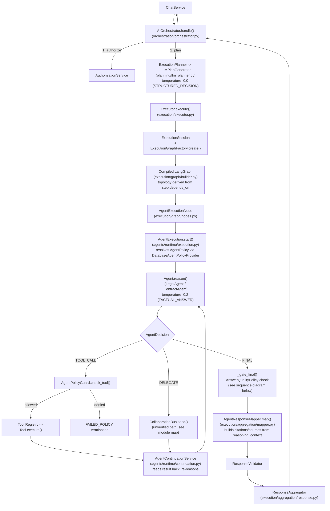
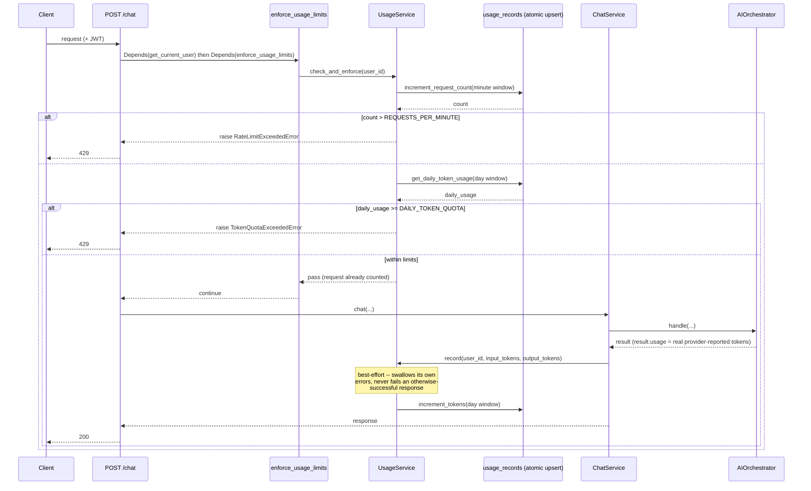

# src/agentic/ — Planning, Orchestration, Execution, Agents, Tools

This file documents the real current architecture in depth, with
diagrams, for someone debugging a production issue six months from
now.

## Module map

| Path | Responsibility |
|---|---|
| `planning/` | Intent analysis, `ExecutionPlan` generation (template-based or LLM-based) |
| `orchestration/` | `AIOrchestrator` — coordinates the request lifecycle; never executes agents/tools itself |
| `execution/` | `Executor`, LangGraph graph construction/compilation, execution state/memory, response aggregation |
| `agents/` | Domain reasoning (`LegalAgent`, `ContractAgent`), prompt building, token budgeting, agent runtime (lifecycle, continuation) |
| `evaluation/` | `AnswerEvaluator` + `AnswerQualityPolicy` — post-hoc answer quality gating (groundedness/relevance/correctness/citations) |
| `guardrails/` | `OutputGuardrailService` — reviews the final aggregated response for harmful content and PII before it leaves the system; called once by `AIOrchestrator` (`handle()`/`resume()`) after aggregation, right before the response is built. See `docs/known-issues.md` for the PII detector's known recall gaps. |
| `policy/` | `AgentPolicyProvider`/`AgentPolicyGuard`/`ToolPermissionGuard` — what tools an agent may call |
| `registry/` | Agent and tool lookup by name |
| `tools/` | External actions: retrieval, web search, case-law search, document parsing, messaging |
| `collaboration/` | `CollaborationBus` — mediated agent-to-agent messaging (DELEGATE decisions). **Unverified/unexercised as of this writing**: no test or production path drives an actual end-to-end delegation; `DELEGATE` is only reachable if an agent's LLM emits that decision type, and nothing in the current prompt-driven flow does so routinely. Treat as present-but-unproven, not present-and-working. |
| `decisions/` | `AgentDecision`/`AgentDecisionType` schemas + validator — the structured contract an agent's LLM call must return |

## Request lifecycle (real, graph-based path)

This is the path every real chat request takes.

`BaseAgent` has no `run()` method today. Its `stream_final_answer()`
method (agents/base.py) is real and live — called from
`graph/nodes.py::_stream_final_answer_if_reached()` on this exact
path, for a streaming session's FINAL step only (see the request
lifecycle diagram below and the `/chat/stream` section further down).



## FINAL-decision quality gate

`AgentContinuationService._gate_final()` evaluates every proposed
FINAL answer before accepting it. The two branches below are the only
two remedies the code has — which one runs depends on *which* quality
check failed.

```mermaid
sequenceDiagram
    participant Agent
    participant Continuation as AgentContinuationService
    participant Evaluator as AnswerEvaluator
    participant Policy as AnswerQualityPolicy
    participant Guard as AgentPolicyGuard
    participant Tool as retriever Tool

    Agent->>Continuation: FINAL decision (answer)
    Continuation->>Evaluator: evaluate(question, answer, evidence)
    Evaluator-->>Continuation: groundedness, relevance,<br/>completeness, correctness
    Continuation->>Policy: is_sufficient(evaluation)

    alt sufficient (groundedness/relevance hard gates pass;<br/>completeness advisory-only)
        Policy-->>Continuation: True
        Continuation-->>Agent: accept FINAL, build response
    else groundedness or relevance failed
        Policy-->>Continuation: False
        Continuation->>Guard: check_tool(policy, "retriever")
        Note over Guard: same check an LLM-proposed<br/>TOOL_CALL would get -- closed this<br/>session, previously bypassed
        alt allowed
            Guard-->>Continuation: allowed
            Continuation->>Tool: execute(query, top_k=8)
            Tool-->>Continuation: fresh evidence
            Continuation->>Agent: re-reason with new evidence
        else denied or tool unavailable
            Guard-->>Continuation: denied
            Continuation->>Agent: weak re-ask (feedback note,<br/>no new evidence)
        end
    else only correctness or citation failed
        Policy-->>Continuation: False
        Note over Continuation: more retrieval isn't the right<br/>remedy for these -- no retry loop
        Continuation->>Agent: weak re-ask (feedback note,<br/>no new evidence)
    end
```

Corrective retrieval (`CORRECTIVE_RETRIEVAL_TOP_K = 8`, broader than a
normal `retriever` call's default `top_k=5`) was added this session —
it is not part of the original design and does not appear in
`docs/architecture/overview.md`'s diagrams.

## Rate limiting and token quota

Enforced per-user, via FastAPI dependency (not ASGI middleware —
middleware runs before auth resolves a user). Both `/chat` and
`/chat/stream` carry the same `enforce_usage_limits` dependency.



**`/chat/stream` note**: the rate-limit dependency runs identically for
both endpoints, so a request that would be blocked is blocked before
either path starts. The post-dispatch `record()` step above is drawn
against `ChatService.chat()`, but `stream_chat()` reaches usage
recording too — both call the same shared
`_persist_assistant_response()` helper (`application/services/chat.py`),
which is what calls `UsageService.record()`. See that method's own
docstring for why this parity is deliberate: it's what stops the two
paths from silently drifting apart the way they once did, back when
`AIOrchestrator.stream()` didn't exist yet.

## `agent_policies` and tool authorization

Real DB table (`agent_policies`: `agent_id` unique, `allowed_tools`
JSON list, `enabled` bool), resolved through
`DatabaseAgentPolicyProvider` (`policy/agent_policy.py`) — a
process-lifetime singleton that opens a fresh DB session per
`get_policy()` call rather than holding one bound session across
concurrent requests. Replaces a static `AGENT_POLICIES = {}` dict —
worth stating plainly since it was once described as merely "inert":
that empty dict actually made every real chat request crash in
production (`AgentExecution.start()` -> `get_policy()` -> uncaught
`AgentPolicyNotFoundError`), not just silently no-op. That's fixed by
the real table described here.

Seeded at startup (`main.py`'s `lifespan()` ->
`wiring/factories/agent_policies.py::seed_default_agent_policies()`,
idempotent upsert):

```python
{
    "legal": ["retriever", "case_law_search"],       # + "web_research" if enabled, see below
    "contract": ["retriever", "parser", "library_lookup"],
}
```

**`web_research` feature flag**: `settings.agent_policy
.ENABLE_WEB_RESEARCH_FOR_LEGAL` (default `False`, env var
`ENABLE_WEB_RESEARCH_FOR_LEGAL`, `config/agent_policy.py`) gates
whether the `legal` agent's default policy includes `web_research`.
Off by default deliberately: it's a broad, open-internet capability
with no production track record — the enforcement path that makes
this grant meaningful (real `AgentPolicyGuard` checks) was only fixed
this session. Flip it once `web_research` has been observed under real
traffic, or grant it directly in `DEFAULT_AGENT_POLICIES` for a
specific deployment.

This is a first-cut seed, not derived from a specification — treat it
as a starting point to adjust, not a settled design.

### Gated-tool replay safety

`AgentContinuationService._execute_gated_tool()` (`agents/runtime/
continuation.py`) pauses a `GATED_TOOLS` (`email`, `slack`) `TOOL_CALL`
via LangGraph's `interrupt()` instead of executing it. LangGraph
replays the *whole* node function from the top on resume, including
any tool call that ran earlier in the same turn — `_execute_tool()`'s
real invocation runs inside a `langgraph.func.task`
(`_call_replay_safe()` in the same module), which checkpoints its
result the first time it runs; a replay returns that cached result
instead of re-invoking the tool. Verified live against the real
Postgres checkpointer: an ungated tool (`retriever`) called before a
gated one (`email`) in the same turn executes exactly once across a
full pause/resume cycle, not twice.

`@task` itself raises outside an active LangGraph runnable context, so
`_call_replay_safe()` falls back to calling the task's plain underlying
function directly when there is none (checked via LangGraph's
`var_child_runnable_config` contextvar, non-raising) — this is what
keeps `AgentContinuationService` unit-testable in isolation (constructed
directly and called without a compiled graph), the pattern this
module's own test suite relies on.

Deliberately not extended to `_delegate()`'s real send the same way:
`DELEGATE` is confirmed unreachable in production today (`AgentPolicyGuard
.check_delegation()` always denies — `allow_delegation` defaults `False`
and `agent_policies` has no column for it), so there's no live replay
hazard to fix yet, and `CollaborationBus.send()` returns a bare `object`
with no established serialization contract to checkpoint safely. Revisit
alongside adding real `allow_delegation` support.

## Temperature / determinism conventions

Every LLM call in this package resolves its sampling config through
`core.dto.inference.InferencePolicy.resolve(task, ...)` rather than
leaving a provider default in place — the one deliberate exception
being agent-facing prose generation, which stays non-zero on purpose.

| Call site | `LLMTask` | Temperature | Why |
|---|---|---|---|
| Planning (`planning/llm_planner.py`) | `STRUCTURED_DECISION` | `0.0` | Produces a structured `ExecutionPlan` consumed programmatically — no reason for run-to-run variance. |
| Agent tool-call/structured decisions (`agents/base.py._reason()`) | `STRUCTURED_DECISION` | `0.0` | Same reasoning — a `TOOL_CALL`/`FINAL` decision is a structured contract, not prose. |
| Agent final-answer generation (`agents/base.py`, `legal.py`, `contract.py`) | `FACTUAL_ANSWER` | `0.2` | Deliberately non-zero: user-facing legal/contract prose, small variance tolerated. Confirmed deliberate this session, left unchanged. |
| Conversation summarization (`application/services/conversation_summarization.py`) | `SUMMARIZATION` | `0.3` | Low but non-zero; consistency matters more than creativity, but summarizing prose isn't a structured decision either. |
| LLM-as-judge — faithfulness/relevancy/context precision-recall (`wiring/factories/evaluation.py::build_llm_judge`) | *(none — direct `LLMInferenceConfig`)* | `0.0` | **Fixed this session** — previously had no inference config at all, silently defaulting to an ambient `0.2`. Judge calls must be reproducible for `AnswerQualityPolicy`'s empirically calibrated thresholds (`agentic/evaluation/answer.py`) to keep meaning anything over time. |

Everything routes through `InferencePolicy` deliberately: it's the one
place a task's sampling intent is declared, instead of relying on
whatever a provider or dataclass default happens to be.

## `/chat/stream` implementation

Implemented, not a gap: `AIOrchestrator.stream()`
(`orchestration/orchestrator.py:911`) is called by
`ChatService.stream_chat()` (`application/services/chat.py`) and
exercised end-to-end — real FastAPI routing, real Postgres, the real
LangGraph checkpointer, real guardrails — by
`tests/e2e/test_chat_stream.py`. See that test's module docstring for
the full "what's real vs. what's mocked" accounting and the
`TEXT_A`/`TEXT_B` two-LLM-call nuance (the aggregated/guardrail-reviewed
decision text and the separately-streamed answer chunks come from two
different LLM calls in production, by design).

## Known gaps

Agentic-specific items; cross-referenced from `docs/known-issues.md`
where this package's gaps are also repo-wide-relevant, rather than
duplicated there:

- **`CollaborationBus`/`DELEGATE` is unverified** — see the module map
  entry above. Real code path, zero real exercise.
- **Citation-quality thresholds are uncalibratable from this dataset**
  — see `src/rag/README.md` → Known gaps and
  `agentic/evaluation/answer.py`'s `AnswerQualityPolicy` docstring for
  the full, honest accounting.
- **Tool-permission enforcement's remaining bypass**: agents hold a
  `RetrieverTool` instance directly (`agents/base.py._retrieve_context()`)
  rather than resolving it via `registry/tool.py` at call time, with no
  policy check at all — a structural bypass of the `TOOL_CALL`
  permission gate in `agents/runtime/execution.py`. Still dead code
  (nothing calls it) as of this writing, but higher-risk than it looks:
  real enforcement now exists everywhere else (see `agent_policies`
  section above), so if this path is ever wired into a live route it
  becomes a real, immediate authorization hole with no second layer of
  brokenness left to mask it. Owner: `agentic/agents/base.py`.
- **Structured per-result data is lost at the `Tool.execute() -> str`
  boundary — one root cause behind several symptoms.** Every `Tool`
  (not just `RetrieverTool`) can only return a flattened string;
  nothing structured (per-chunk score, title, document id) survives
  past that boundary into `ToolResult`/`ToolEvidence` or anything built
  from them downstream. Concretely, `ToolResultConverter
  ._to_retrieved_content()` sets `source_name=result.tool_name`
  unconditionally (always the tool's own name, e.g. `"retriever"`,
  never a real document/title); citations built by
  `AgentResponseMapper` inherit the same ceiling. Fixing this needs a
  change to the `Tool.execute()` contract itself across every
  implementation, not a patch to any one caller. Owner:
  `agentic/tools/base.py` + `agentic/tools/retrieval.py` (and any other
  concrete `Tool`).
- **`AgentResponseDTO.usage` is never populated** — see
  `docs/known-issues.md` for the full trace and production
  consequence (the daily token quota has never actually been fed by a
  real request).
