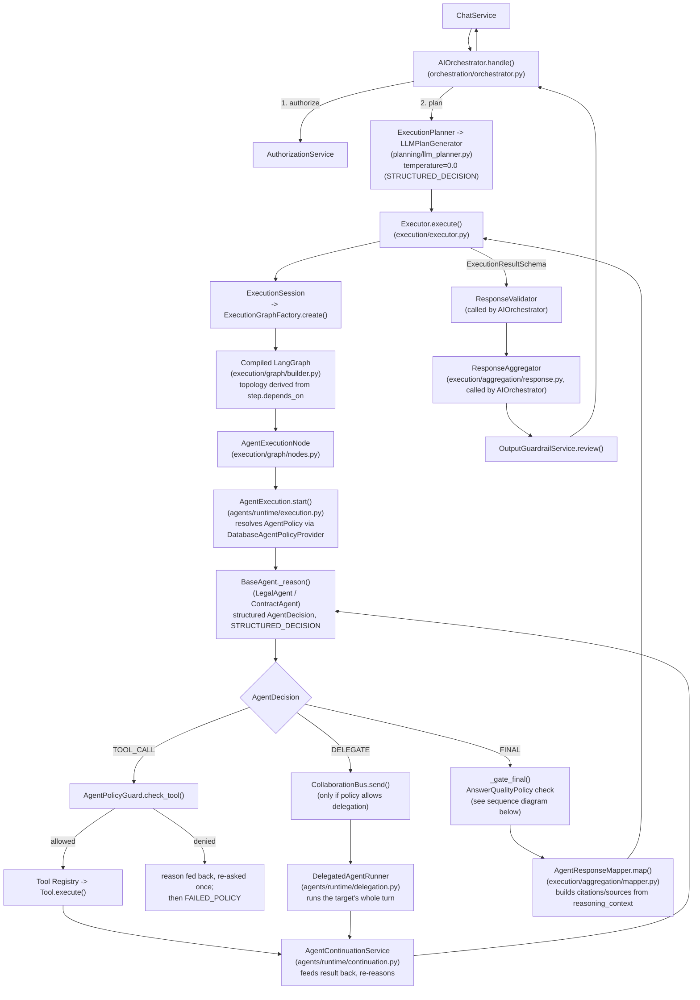
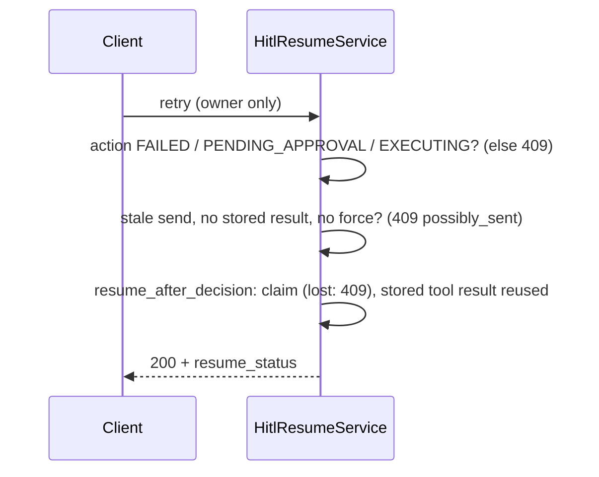

# src/agentic/ — Planning, Orchestration, Execution, Agents, Tools

This file documents the real current architecture in depth, with
diagrams, for someone debugging a production issue six months from
now.

## Module map

Every component below has its own `README.md` (workflow diagram, verified 2026-09-23) and `CLAUDE.md` (rules, gotchas, scoped test command).

| Path | Responsibility | Docs |
|---|---|---|
| `planning/` | Intent analysis, `ExecutionPlanDTO` generation (template-based or LLM-based) | [README](planning/README.md) |
| `orchestration/` | `AIOrchestrator` — coordinates the request lifecycle; never executes agents/tools itself | [README](orchestration/README.md) |
| `execution/` | `Executor`, LangGraph graph construction/compilation, execution state/memory, response aggregation | [README](execution/README.md) |
| `agents/` | Domain reasoning (`LegalAgent`, `ContractAgent`), prompt building, token budgeting, agent runtime (lifecycle, continuation) | [README](agents/README.md), [runtime/](agents/runtime/README.md) |
| `evaluation/` | `AnswerEvaluator` + `AnswerQualityPolicy` — post-hoc answer quality gating (groundedness/relevance/correctness/citations) | [README](evaluation/README.md) |
| `guardrails/` | `OutputGuardrailService` — reviews the final aggregated response for harmful content and PII, and treats a harmful-content check that can't complete as harmful; called once by `AIOrchestrator` (`handle()`/`resume()`) after aggregation, right before the response is built. | [README](guardrails/README.md) |
| `policy/` | `AgentPolicyProvider`/`AgentPolicyGuard`/`ToolPermissionGuard` — what tools an agent may call | [README](policy/README.md) |
| `registry/` | Agent and tool lookup by name | [README](registry/README.md) |
| `tools/` | External actions: retrieval, web search, case-law search, document parsing, messaging | [README](tools/README.md) |
| `collaboration/` | `CollaborationBus` — mediated agent-to-agent messaging (DELEGATE decisions). Delegation is disabled by default: `AgentPolicyGuard.check_delegation()` requires `allow_delegation`, which no agent policy grants. | [README](collaboration/README.md) |
| `decisions/` | `AgentDecision`/`AgentDecisionType` schemas + validator — the structured contract an agent's LLM call must return | [README](decisions/README.md) |

## Request lifecycle (real, graph-based path)

This is the path every real chat request takes.

Each agent step starts with a retriever call for the user's question
(`AgentContinuationService.seed_evidence()`), so the agent reasons over
retrieved sources. An answer that can't be checked against evidence, or
that fails the answer-quality gate with no budget left to improve it, is
replaced with a fixed "no sources" / "couldn't verify" answer and marked
`answer_verified=False`.


```mermaid
flowchart TD
    REQ[ChatService] --> ORCH["AIOrchestrator.handle()<br/>(orchestration/orchestrator.py)"]
    ORCH -->|1. authorize| AUTH[AuthorizationService]
    ORCH -->|2. plan| PLAN["ExecutionPlanner -> LLMPlanGenerator<br/>(planning/llm_planner.py)<br/>temperature=0.0 (STRUCTURED_DECISION)"]
    PLAN --> EXECUTOR["Executor.execute()<br/>(execution/executor.py)"]
    EXECUTOR --> SESSION["ExecutionSession<br/>-> ExecutionGraphFactory.create()"]
    SESSION --> GRAPH["Compiled LangGraph<br/>(execution/graph/builder.py)<br/>topology derived from step.depends_on"]
    GRAPH --> NODE["AgentExecutionNode<br/>(execution/graph/nodes.py)"]
    NODE --> AEXEC["AgentExecution.start()<br/>(agents/runtime/execution.py)<br/>resolves AgentPolicy via DatabaseAgentPolicyProvider"]
    AEXEC --> AGENT["BaseAgent._reason()<br/>(LegalAgent / ContractAgent)<br/>structured AgentDecision, STRUCTURED_DECISION"]
    AGENT --> DECISION{AgentDecision}
    DECISION -->|TOOL_CALL| GUARD["AgentPolicyGuard.check_tool()"]
    GUARD -->|allowed| TOOLREG["Tool Registry -> Tool.execute()"]
    GUARD -->|denied| FAILPOLICY["reason fed back, re-asked once;<br/>then FAILED_POLICY"]
    TOOLREG --> CONT["AgentContinuationService<br/>(agents/runtime/continuation.py)<br/>feeds result back, re-reasons"]
    CONT --> AGENT
    DECISION -->|DELEGATE| BUS["CollaborationBus.send()<br/>(only if policy allows delegation)"]
    BUS --> RUNNER["DelegatedAgentRunner<br/>(agents/runtime/delegation.py)<br/>runs the target's whole turn"]
    RUNNER --> CONT
    DECISION -->|FINAL| GATE["_gate_final()<br/>AnswerQualityPolicy check<br/>(see sequence diagram below)"]
    GATE --> MAPPER["AgentResponseMapper.map()<br/>(execution/aggregation/mapper.py)<br/>builds citations/sources from reasoning_context"]
    MAPPER --> EXECUTOR
    EXECUTOR -->|ExecutionResultSchema| VALIDATOR["ResponseValidator<br/>(called by AIOrchestrator)"]
    VALIDATOR --> AGG["ResponseAggregator<br/>(execution/aggregation/response.py, called by AIOrchestrator)"]
    AGG --> GR["OutputGuardrailService.review()"]
    GR --> ORCH
    ORCH --> REQ
```

## FINAL-decision quality gate

`AgentContinuationService._gate_final()` evaluates every proposed
FINAL answer before accepting it. The two branches below are the only
two remedies the code has — which one runs depends on *which* quality
check failed.

```mermaid
sequenceDiagram
    participant Agent
    participant Continuation as AgentContinuationService
    participant Evaluator as AnswerEvaluator
    participant Policy as AnswerQualityPolicy
    participant Guard as AgentPolicyGuard
    participant Tool as retriever Tool

    Agent->>Continuation: FINAL decision (answer)
    Continuation->>Evaluator: evaluate(question, answer, evidence)
    Evaluator-->>Continuation: groundedness, relevance,<br/>completeness, correctness
    Continuation->>Policy: is_sufficient(evaluation)

    alt sufficient (groundedness/relevance hard gates pass;<br/>completeness advisory-only)
        Policy-->>Continuation: True
        Continuation-->>Agent: accept FINAL, build response
    else groundedness or relevance failed
        Policy-->>Continuation: False
        Continuation->>Guard: check_tool(policy, "retriever")
        Note over Guard: same check an LLM-proposed<br/>TOOL_CALL gets
        alt allowed
            Guard-->>Continuation: allowed
            Continuation->>Tool: execute(query, top_k=8)
            Tool-->>Continuation: fresh evidence
            Continuation->>Agent: re-reason with new evidence
        else denied or tool unavailable
            Guard-->>Continuation: denied
            Continuation->>Agent: weak re-ask (feedback note,<br/>no new evidence)
        end
    else only correctness or citation failed
        Policy-->>Continuation: False
        Note over Continuation: more retrieval isn't the right<br/>remedy for these -- no retry loop
        Continuation->>Agent: weak re-ask (feedback note,<br/>no new evidence)
    end
```

Corrective retrieval (`CORRECTIVE_RETRIEVAL_TOP_K = 8`, broader than a
normal `retriever` call's default `top_k=5`) is not part of the original
design and does not appear in `docs/server/architecture/overview.md`'s
diagrams.

## Rate limiting and token quota

Enforced per-user, via FastAPI dependency (not ASGI middleware —
middleware runs before auth resolves a user). Both `/chat` and
`/chat/stream` carry the same `enforce_usage_limits` dependency.

```mermaid
sequenceDiagram
    participant Client
    participant Endpoint as POST /chat
    participant Dep as enforce_usage_limits
    participant Usage as UsageService
    participant DB as usage_records (atomic upsert)
    participant Chat as ChatService
    participant Orch as AIOrchestrator

    Client->>Endpoint: request (+ JWT)
    Endpoint->>Dep: Depends(get_current_user) then Depends(enforce_usage_limits)
    Dep->>Usage: check_and_enforce(user_id)
    Usage->>DB: increment_request_count(minute window)
    DB-->>Usage: count
    alt count > REQUESTS_PER_MINUTE
        Usage-->>Endpoint: raise RateLimitExceededError
        Endpoint-->>Client: 429
    else
        Usage->>DB: get_daily_token_usage(day window)
        DB-->>Usage: daily_usage
        alt daily_usage >= DAILY_TOKEN_QUOTA
            Usage-->>Endpoint: raise TokenQuotaExceededError
            Endpoint-->>Client: 429
        else within limits
            Usage-->>Dep: pass (request already counted)
            Dep-->>Endpoint: continue
            Endpoint->>Chat: chat(...)
            Chat->>Orch: handle(...)
            Orch-->>Chat: result, or raises (usage scopes close into the tally)
            Chat->>Usage: finally: record(user_id, request_id, input, output)
            Note over Usage: best-effort, own session, shielded from<br/>cancellation; once per request_id
            Usage->>DB: usage_request_records row (ON CONFLICT DO NOTHING),<br/>then increment_tokens(day window) if new
            Chat-->>Endpoint: response
            Endpoint-->>Client: 200
        end
    end
```

**`/chat/stream` note**: the rate-limit dependency runs identically for
both endpoints, so a request that would be blocked is blocked before
either path starts. The post-dispatch `record()` step above is drawn
against `ChatService.chat()`; `stream_chat()` records the same way, from
its own `finally` (`_record_usage()`, `application/services/chat.py`).

**Where `result.usage` comes from**: every `LLMClient.generate()` call
adds its provider-reported token counts to a per-request meter
(`core/usage.py`, a `ContextVar` like `core/deadline.py`; asyncio tasks
and LangGraph nodes share the scope's meter). `AIOrchestrator.handle()`,
`stream()` and `resume()` each open one scope and set the response's
`usage` from it: planner, agents (including a failover call, counted once
under the fallback's provider), answer evaluation and the guardrail
judge. It isn't summed from agent responses.

**Recorded however the request ends** (review R19): `ChatService` opens a
`usage_tally()` (`core/usage.py`) around each request; every usage scope
adds its meter to it when it closes, whether the turn returned, raised or
was cancelled. `ChatService` records the tally once, in a `finally`: after
an answer, an error, a quota refusal, or a client disconnecting from
`/chat/stream` (the orchestrator's stream is closed with `aclosing`, and the
write runs shielded on its own session so the cancellation can't cut it
off). `UsageService.record()` is idempotent per request id: a
`usage_request_records` row (unique `request_id`) is inserted first and the
day bucket grows only if that row is new. `HitlResumeService` records a
resumed turn the same way, keyed by the resumed turn's own request id.
Not counted: the background memory-extraction call.

**Per-request token quota** (`RATE_LIMIT_REQUEST_TOKEN_QUOTA`): the same
meter caps one request. `ChatService` sets the quota from
`UsageService.request_token_quota()` (`core.usage.request_token_quota()`)
around `handle()`/`stream()`; the scope opened inside picks it up, with
the tokenizer estimate (`agents/prompts/token_budget.py`
`estimate_tokens`). `LLMClient.generate()` checks each call before it is
made: tokens used so far plus the estimated prompt must fit, or the call
raises `RequestTokenQuotaExceededError` and never reaches the provider.
Wherever it is caught (the agent runtime turns it into a failed step),
the orchestrator re-raises it at the end of the turn, before any answer
is sent; `ChatService` records the tokens used (from its tally, like any
failed request) and re-raises (413). A resumed turn has no quota (nothing sets one).

## `agent_policies` and tool authorization

Real DB table (`agent_policies`: `agent_id` unique, `allowed_tools`
JSON list, `enabled` bool), resolved through
`DatabaseAgentPolicyProvider` (`policy/agent_policy.py`) — a
process-lifetime singleton that opens a fresh DB session per
`get_policy()` call rather than holding one bound session across
concurrent requests. Replaces a static `AGENT_POLICIES = {}` dict —
worth stating plainly since it was once described as merely "inert":
that empty dict actually made every real chat request crash in
production (`AgentExecution.start()` -> `get_policy()` -> uncaught
`AgentPolicyNotFoundError`), not just silently no-op. That's fixed by
the real table described here.

Seeded at startup (`main.py`'s `lifespan()` ->
`wiring/factories/agent_policies.py::seed_default_agent_policies()`,
idempotent upsert):

```python
{
    "legal": ["retriever", "case_law_search"],       # + "web_research" if enabled, see below
    "contract": ["retriever", "library_lookup"],
}
```

**`web_research` feature flag**: `settings.agent_policy
.ENABLE_WEB_RESEARCH_FOR_LEGAL` (default `False`, env var
`ENABLE_WEB_RESEARCH_FOR_LEGAL`, `config/agent_policy.py`) gates
whether the `legal` agent's default policy includes `web_research`.
Off by default deliberately: it's a broad, open-internet capability
with no production track record — the enforcement path that makes
this grant meaningful (real `AgentPolicyGuard` checks) was only fixed
this session. Flip it once `web_research` has been observed under real
traffic, or grant it directly in `_build_default_agent_policies()`
(`wiring/factories/agent_policies.py`) for a specific deployment.

**Messaging feature flag**: `settings.agent_policy
.ENABLE_MESSAGING_TOOLS` (default `False`, env var
`ENABLE_MESSAGING_TOOLS`, `config/agent_policy.py`) adds
`MESSAGING_TOOLS` (`email`, `email_send`, `slack`, `slack_post`) to both
the `legal` and `contract` default policies. The read tools (`email`,
`slack`) run directly. The send tools (`email_send`, `slack_post`) are
in `GATED_TOOLS`, so every call pauses for the user's approval. They
also need a role that grants `send` (the default `member` role does;
`reader` doesn't). The flag alone doesn't make the tools work:
`MCP_GMAIL_SERVER_URL` / `MCP_SLACK_SERVER_URL` (`config/llm.py`) must
point at the messaging MCP servers. Otherwise every call fails cleanly
with "unknown MCP server".

This is a first-cut seed, not derived from a specification — treat it
as a starting point to adjust, not a settled design.

### Gated-tool replay safety

`AgentContinuationService._execute_gated_tool()` (`agents/runtime/
continuation.py`) pauses a `GATED_TOOLS` (`email_send`, `slack_post`) `TOOL_CALL`
via LangGraph's `interrupt()` instead of executing it. LangGraph
replays the *whole* node function from the top on resume, including
any tool call that ran earlier in the same turn — `_execute_tool()`'s
real invocation runs inside a `langgraph.func.task`
(`_call_replay_safe()` in the same module), which checkpoints its
result the first time it runs; a replay returns that cached result
instead of re-invoking the tool. Verified live against the real
Postgres checkpointer: an ungated tool (`retriever`) called before a
gated one in the same turn executes exactly once across a full
pause/resume cycle, not twice.

The approved call itself runs outside the graph, before it resumes:
`HitlResumeService` runs it through `Executor.run_approved_tool()` with
the approved (or edited) parameters and commits its result on the
`AgentAction` first. A retried resume (`POST /approvals/{id}/resume`,
below) reuses that stored result, so a send is never repeated; and a
thread whose graph already finished returns its final state unchanged
on resume.

`@task` itself raises outside an active LangGraph runnable context, so
`_call_replay_safe()` falls back to calling the task's plain underlying
function directly when there is none (checked via LangGraph's
`var_child_runnable_config` contextvar, non-raising) — this is what
keeps `AgentContinuationService` unit-testable in isolation (constructed
directly and called without a compiled graph), the pattern this
module's own test suite relies on.

`_delegate()` is not wrapped in the same `@task` pattern: delegation is
disabled by default (no agent policy grants `allow_delegation`), and
`CollaborationBus.send()` returns a bare `object` with no serialization
contract to checkpoint. The delegated target's own tool calls do run
through `_execute_tool()`, so each is checkpointed individually, but its
reasoning re-runs on a replay. Wrap `_delegate()` the same way if
delegation is enabled.

### Approval decisions

A paused gated call becomes an `Approval` owned by the user whose request
produced it (`Approval.requested_by`, set by `ActionWorkflowService` via
`ApprovalLifecycleService.create()`). Only that user can decide it:
`ApprovalLifecycleService` checks ownership before looking at the
approval's expiry or status, and any other authenticated user receives
HTTP 403 (`ApprovalForbiddenError`) with the approval left unchanged.

```mermaid
sequenceDiagram
    autonumber
    participant C as Client (authenticated user)
    participant API as POST /api/v1/approvals/:approval_id
    participant ALSO as ApprovalLifecycleService
    participant HR as HitlResumeService
    participant X as Executor

    C->>API: decision (approve / reject / edit)
    API->>ALSO: process(approval_id, request, user_id)
    ALSO->>ALSO: load Approval; requested_by == user_id?
    alt not the requester
        ALSO-->>API: ApprovalForbiddenError
        API-->>C: 403
    else requester
        ALSO->>ALSO: expired? (commit EXPIRED, 410) still WAITING? (else 409)<br/>then save the decision only if still WAITING (conditional UPDATE; lost: 409)<br/>+ compliance log and commit
        ALSO-->>API: ApprovalResponseDTO
        API->>HR: resume_after_decision(approval_id, agent_action_id, decision_type, edited_payload)
        HR->>X: approve/edit: run_approved_tool(approved draft, token=approval_id),<br/>result committed on the AgentAction; reject: nothing runs
        HR->>X: resume(thread_id, tool_result) -> the paused graph continues
        HR-->>API: resume_status (completed / failed / in_progress)
        API-->>C: 200 + decision + resume_status
    end
```

A decided approval whose resume didn't finish (it failed, or the server
stopped before it completed) is retried by its requester with
`POST /api/v1/approvals/{approval_id}/resume`: 403 for anyone else, 409
if it isn't decided, has already been resumed, or another request is
resuming it. The retry reuses a stored tool result instead of running the
call again.

Every resume (the decision's or a retry) first claims the `AgentAction`
with one conditional `UPDATE` to `EXECUTING`, committed at once
(`AgentActionRepository.claim()`). Only the request that wins runs the
call and resumes the graph; an overlapping one gets `resume_status`
`in_progress` (decision) or 409 (retry), in any worker. An action left
`EXECUTING` by a worker that stopped can be claimed again, by a retry
only, after `HITL_RESUME_STALE_SECONDS` (default 600) without progress.
If it was an approved send with no stored result, the message may already
have gone out: the retry gets 409 `APPROVAL_RESUME_NEEDS_CONFIRMATION`
(`details.possibly_sent`) unless the user passes `force=true`, which is
logged at WARNING (action id, user) and sends once.

Before a *fresh* approved call runs (on the first resume or a retry),
`HitlResumeService` re-checks the user's current permission
(`AuthorizationService.authorize_action`, roles are DB data and may have
changed since the approval). If it's refused, nothing is sent: a failed
`PermissionDenied` result is stored and handed to the agent, and a later
retry is refused (409). Reusing a stored result isn't re-checked -- that
call already ran.


```mermaid
sequenceDiagram
    participant C as Client
    participant HR as HitlResumeService
    C->>HR: retry (owner only)
    HR->>HR: action FAILED / PENDING_APPROVAL / EXECUTING? (else 409)
    HR->>HR: stale send, no stored result, no force? (409 possibly_sent)
    HR->>HR: resume_after_decision: claim (lost: 409), stored tool result reused
    HR-->>C: 200 + resume_status
```

The decision is committed before `HitlResumeService` runs, so nothing
that happens during resume can undo it. A resume failure rolls back
only the resume's own writes, marks the `AgentAction` `FAILED` (with
the error type in `result`) in a separate commit, and is reported as
`resume_status: failed`; nothing retries it automatically -- the
requester retries it with the endpoint above. A failure after the
approved call ran keeps its stored result on the `AgentAction`.

`get()` and `validate()` apply the same ownership check when called with
a `user_id`.

Only one decision is ever recorded. `ApprovalRepository.save_decision()`
writes it with one conditional `UPDATE ... WHERE status = 'waiting'
RETURNING`, so of two concurrent decisions (approve and reject from two
tabs, in any workers) the second finds no waiting row: it gets 409
`APPROVAL_ALREADY_DECIDED` with `details.current_status`, writes no
compliance record and resumes nothing. Only a recorded approve or edit
runs the call.

## Temperature / determinism conventions

Every LLM call in this package resolves its sampling config through
`core.dto.inference.InferencePolicy.resolve(task, ...)` rather than
leaving a provider default in place. (`LLMTask.FACTUAL_ANSWER`, 0.2, is
still defined and still declared as the agents' `inference_task`, but no
agent call uses it since the separate streamed answer generation was
removed.)

| Call site | `LLMTask` | Temperature | Why |
|---|---|---|---|
| Planning (`planning/llm_planner.py`) | `STRUCTURED_DECISION` | `0.0` | Produces a structured `ExecutionPlanDTO` consumed programmatically — no reason for run-to-run variance. |
| Agent decisions, including the FINAL answer text (`agents/base.py._reason()`) | `STRUCTURED_DECISION` | `0.0` | Same reasoning — a `TOOL_CALL`/`FINAL` decision is a structured contract. The FINAL answer is a field of that decision; there is no separate answer generation. |
| Conversation summarization (`application/services/conversation_summarization.py`) | `SUMMARIZATION` | `0.3` | Low but non-zero; consistency matters more than creativity, but summarizing prose isn't a structured decision either. |
| LLM-as-judge — faithfulness/relevancy/context precision-recall (`wiring/factories/evaluation.py::build_llm_judge`) | *(none — direct `LLMInferenceConfig`)* | `0.0` | **Fixed this session** — previously had no inference config at all, silently defaulting to an ambient `0.2`. Judge calls must be reproducible for `AnswerQualityPolicy`'s empirically calibrated thresholds (`agentic/evaluation/answer.py`) to keep meaning anything over time. |

Everything routes through `InferencePolicy` deliberately: it's the one
place a task's sampling intent is declared, instead of relying on
whatever a provider or dataclass default happens to be.

## `/chat/stream` implementation

`AIOrchestrator.stream()`
(`orchestration/orchestrator.py`) is called by
`ChatService.stream_chat()` (`application/services/chat.py`) and
exercised end-to-end — real FastAPI routing, real Postgres, the real
LangGraph checkpointer, real guardrails — by
`tests/e2e/test_chat_stream.py`. See that test's module docstring for
the full "what's real vs. what's mocked" accounting. The streamed text
is the guardrail-reviewed answer itself, sent in slices once review is
done — the same text `ChatService` persists; there is no second
generation.

---

Known architecture and security gaps are tracked privately by the maintainers.
