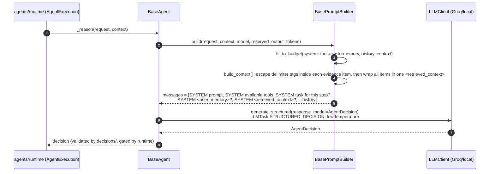

# src/agentic/agents/ — Domain Agents and Prompt Construction

Verified against the code on 2026-09-23. The per-turn loop that drives an
agent lives in `runtime/` (its own README).

## Purpose

An agent turns one `AgentRequestDTO` plus accumulated evidence into either
a structured `AgentDecision` (`FINAL`, `TOOL_CALL`, `DELEGATE`,
`NEED_INPUT`, `FAIL`). Agents never call tools or adapters themselves;
they propose a `TOOL_CALL` and the runtime executes it.

## Components

| File | Class | Role |
|---|---|---|
| `base.py` | `BaseAgent` | `_reason()` (structured decision), `handle_message()` (collaboration bus) |
| `legal.py` | `LegalAgent` | name `legal`; `LegalPromptBuilder`; `inference_task = FACTUAL_ANSWER` |
| `contract.py` | `ContractAgent` | name `contract`; `ContractPromptBuilder`; `inference_task = FACTUAL_ANSWER` |
| `prompts/base.py` | `BasePromptBuilder` | Loads the template, budgets tokens, assembles messages, wraps evidence in `<retrieved_context>` after escaping any `<retrieved_context>`/`</retrieved_context>` tag inside the content (`core/utils/prompt_safety.escape_delimiter`), so evidence can't close the wrapper early |
| `prompts/token_budget.py` | `fit_to_budget()` | tiktoken-based trimming: system prompt never truncated; oldest history, then lowest-scored context dropped first |
| `prompts/tool_catalog.py` | `render_tool_catalog()` | "Available tools" block: each tool the agent's policy allows, with its parameter JSON Schema (`AgentRequestDTO.tool_catalog`, set by `AgentExecution.start()`); says so when there are none |
| `prompts/step_task.py` | `render_step_task()` | "Task for this step" block: the plan step's instruction and arguments, size-capped (or "") |
| `prompts/user_memory.py` | `render_user_memory_block()` | `<user_memory>` block (or "") |
| `prompts/templates/{legal,contract}.md` | — | System prompts: decision rules and the untrusted-content warning |

## One LLM call per reasoning step

`/chat/stream` streams the FINAL answer's own text after it has been
reviewed; there is no separate streaming generation.

Before the first `_reason()` call, `context` holds any files attached to
the chat message (parsed by the Executor) and the runtime seeds it with a
retriever call for the user's question
(`AgentContinuationService.seed_evidence()`), so the agent starts from
the user's documents and retrieved sources.

---

Known architecture and security gaps are tracked privately by the maintainers.
