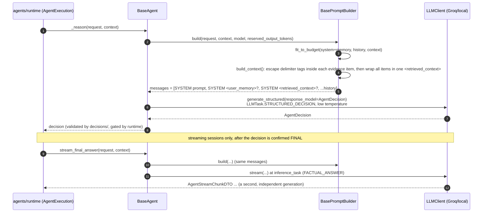

# src/agentic/agents/ — Domain Agents and Prompt Construction

Verified against the code on 2026-09-23. The per-turn loop that drives an
agent lives in `runtime/` (its own README).

## Purpose

An agent turns one `AgentRequestDTO` plus accumulated evidence into either
a structured `AgentDecision` (`FINAL`, `TOOL_CALL`, `DELEGATE`,
`NEED_INPUT`, `FAIL`) or, once the runtime has confirmed `FINAL`, a
streamed plain-text answer. Agents never call tools or adapters
themselves; they propose a `TOOL_CALL` and the runtime executes it.

## Components

| File | Class | Role |
|---|---|---|
| `base.py` | `BaseAgent` | `_reason()` (structured decision), `stream_final_answer()` (plain-text regeneration), `handle_message()` (collaboration bus) |
| `legal.py` | `LegalAgent` | name `legal`; `LegalPromptBuilder`; `inference_task = FACTUAL_ANSWER` |
| `contract.py` | `ContractAgent` | name `contract`; `ContractPromptBuilder`; `inference_task = FACTUAL_ANSWER` |
| `prompts/base.py` | `BasePromptBuilder` | Loads the template, budgets tokens, assembles messages, wraps evidence in `<retrieved_context>` after escaping any `<retrieved_context>`/`</retrieved_context>` tag inside the content (`core/utils/prompt_safety.escape_delimiter`), so evidence can't close the wrapper early |
| `prompts/token_budget.py` | `fit_to_budget()` | tiktoken-based trimming: system prompt never truncated; oldest history, then lowest-scored context dropped first |
| `prompts/user_memory.py` | `render_user_memory_block()` | `<user_memory>` block (or "") |
| `prompts/templates/{legal,contract}.md` | — | System prompts: decision rules and the untrusted-content warning |

## Two LLM calls per answering turn

---

Known architecture and security gaps are tracked privately by the maintainers.
