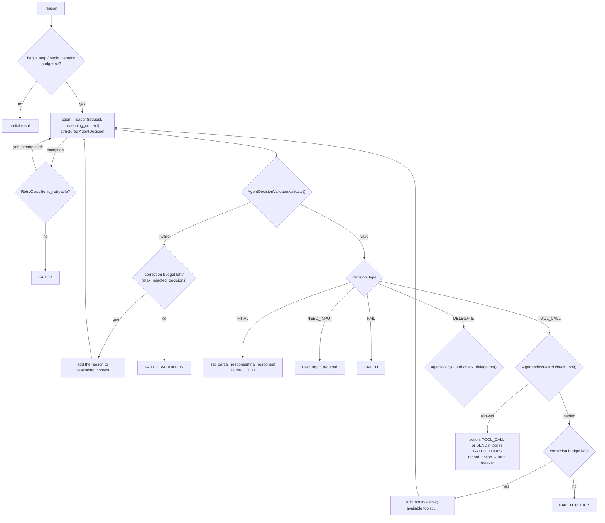

# src/agentic/agents/runtime/ — The Agent Turn Loop

Verified against the code on 2026-09-23. This is what runs inside each
LangGraph node (`execution/graph/nodes.py`, `AgentExecutionNode`). Added by
JA-54 / PR #35; it sits **under** `execution/`, not in place of it.

## Components

| File | Class | Role |
|---|---|---|
| `execution.py` | `AgentExecution` | `start()` (loads the agent's `AgentPolicy` from the DB) → `AgentExecutionHandle` |
| `execution.py` | `AgentExecutionHandle` | `reason()`: one bounded reasoning attempt (budgets → `_reason()` → decision validation → decision handling); owns `reasoning_context` |
| `continuation.py` | `AgentContinuationService` | `execute()`: loops TOOL_CALL / DELEGATE → re-reason, gates FINAL through `_gate_final`, pauses gated tools via `interrupt()` |
| `retry.py` | `RetryClassifier` | Which reasoning exceptions are retryable (configured in `wiring/factories/executor.py`) |
| `lifecycle/lifecycle.py` | `AgentLifecycle` | Budget checks + state transitions (`complete`, `fail`, `partial`, `user_input_required`) |
| `lifecycle/budget.py` | `AgentExecutionBudget` | Limits: 10 iterations, 20 tool calls, 5 hops, 30 steps, 120 s, repeated action 2, no-progress 2, validation 2, plus record-count and size caps |
| `lifecycle/guard.py` | `BudgetGuard` | Per-limit checks returning `BudgetCheckResult` |
| `lifecycle/loop_breaker.py` | `LoopBreaker` | Repeated-action and no-progress detection |
| `lifecycle/termination.py`, `state.py` | `TerminationReason`, `AgentExecutionStatus`, `AgentTerminator`, `AgentState` | Why and how a turn ended |

## One reasoning attempt (`AgentExecutionHandle.reason()`)



## The continuation loop (`AgentContinuationService.execute()`)

```mermaid
sequenceDiagram
    autonumber
    participant N as AgentExecutionNode
    participant C as AgentContinuationService
    participant H as AgentExecutionHandle
    participant T as ToolExecutionService
    participant E as AnswerEvaluator

    N->>H: reason()
    N->>C: execute(handle, initial_result)
    loop while the decision is TOOL_CALL or DELEGATE
        alt action SEND (email/slack)
            C->>C: _execute_gated_tool → LangGraph interrupt()<br/>(graph pauses; Executor.resume() runs the tool later)
        else TOOL_CALL
            C->>T: execute(tool_name, parameters) inside @task (replay-safe)
            T-->>C: ToolResult
            alt tool failed
                C->>H: add the sanitized error to reasoning_context and reason() again,<br/>unless the same failure repeats (no-progress) or a reviewer rejected it
                C-->>N: FAILED_TOOL (only then)
            end
        end
        C->>H: extend_reasoning_context(ToolResult → RetrievedContentDTO)
        C->>C: record_progress (no-progress breaker)
        C->>H: reason()
    end
    alt decision FINAL
        C->>E: evaluate(question, answer, evidence)
        alt sufficient
            C-->>N: accept + AnswerEvaluationSummary
        else groundedness/relevance failed, budget ok
            C->>T: forced TOOL_CALL "retriever" (policy-checked)
            C->>H: reason() again
        else other failure, budget ok
            C->>H: add evaluator feedback to context, reason() again
        else step budget exhausted
            C-->>N: terminal_result()
        end
    end
```

---

Known architecture and security gaps are tracked privately by the maintainers.
