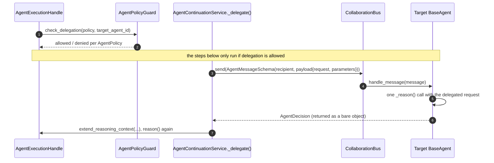

# src/agentic/collaboration/ — Agent-to-Agent Messaging (DELEGATE)

Verified against the code on 2026-09-23. Delegation is disabled by
default: no agent policy grants `allow_delegation`.

## Purpose

`CollaborationBus` (`bus.py`) routes an `AgentMessageSchema` to the
recipient agent's `handle_message()`, which performs **one** reasoning
step (no tools, no further delegation) and returns its `AgentDecision` to
the delegating agent.

Both `legal` and `contract` are registered on the bus at startup
(`wiring/factories/agents.py:74-80`); the bus is created once in
`wiring/composition.py:54`.

## Flow

---

Known architecture and security gaps are tracked privately by the maintainers.
