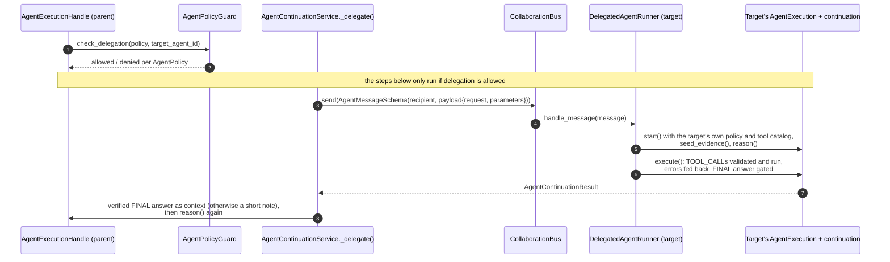

# src/agentic/collaboration/ — Agent-to-Agent Messaging (DELEGATE)

Verified against the code on 2026-09-28. Delegation is disabled by
default: no agent policy grants `allow_delegation`.

## Purpose

`CollaborationBus` (`bus.py`) routes an `AgentMessageSchema` to the
handler registered for the recipient agent. That handler is a
`DelegatedAgentRunner` (`agents/runtime/delegation.py`), not the agent
itself: it runs the target agent's whole turn on the same runtime path as
a plan step, with the target's own tools and policy, and returns the
result to the delegating agent.

One runner per registered agent is put on the bus at startup, in
`create_executor()` (`wiring/factories/executor.py`); the bus is created
once in `wiring/composition.py`.

## Flow

```mermaid
sequenceDiagram
    autonumber
    participant H as AgentExecutionHandle (parent)
    participant G as AgentPolicyGuard
    participant C as AgentContinuationService._delegate()
    participant B as CollaborationBus
    participant R as DelegatedAgentRunner (target)
    participant T as Target's AgentExecution + continuation

    H->>G: check_delegation(policy, target_agent_id)
    G-->>H: allowed / denied per AgentPolicy
    Note over H,T: the steps below only run if delegation is allowed
    C->>B: send(AgentMessageSchema(recipient, payload{request, parameters}))
    B->>R: handle_message(message)
    R->>T: start() with the target's own policy and tool catalog,<br/>seed_evidence(), reason()
    R->>T: execute(): TOOL_CALLs validated and run,<br/>errors fed back, FINAL answer gated
    T-->>C: AgentContinuationResult
    C->>H: verified FINAL answer as context (otherwise a short note),<br/>then reason() again
```

---

Known architecture and security gaps are tracked privately by the maintainers.
