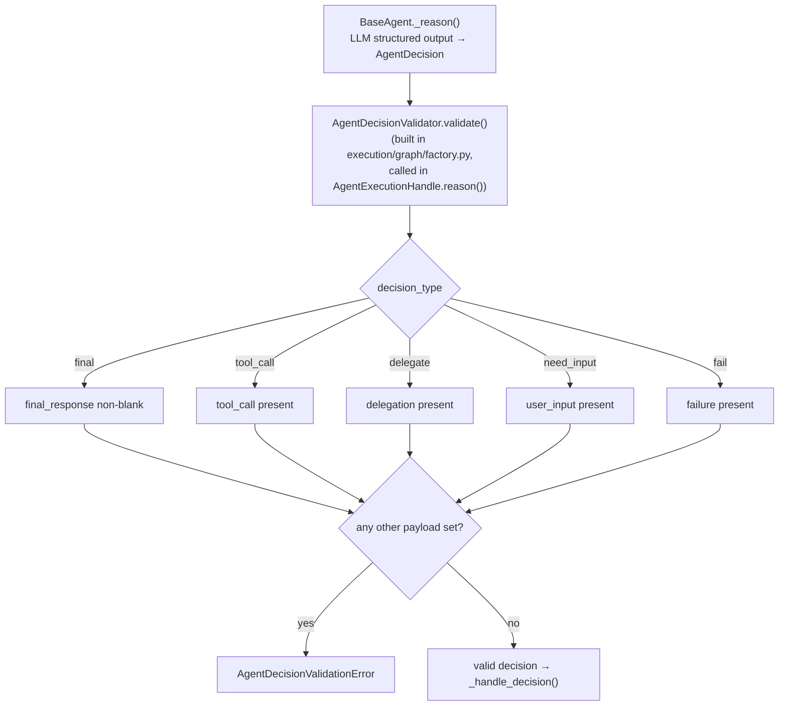

# src/agentic/decisions/ — The Agent Decision Contract

Verified against the code on 2026-09-23.

## Purpose

Defines what an agent may return from one reasoning step and rejects
malformed decisions before the runtime acts on them.

| File | Contents |
|---|---|
| `decision.py` | `AgentDecisionType`: `final`, `tool_call`, `delegate`, `need_input`, `fail` |
| `schemas.py` | `AgentDecision` (Pydantic; the `response_model` for `BaseAgent._reason()`), `AgentToolCall(tool_name, parameters: dict)`, `AgentDelegation`, `AgentUserInputRequest`, `AgentFailure` |
| `validator.py` | `AgentDecisionValidator.validate()`: per-type required payload, and every other payload must be empty |

## Flow

---

Known architecture and security gaps are tracked privately by the maintainers.
