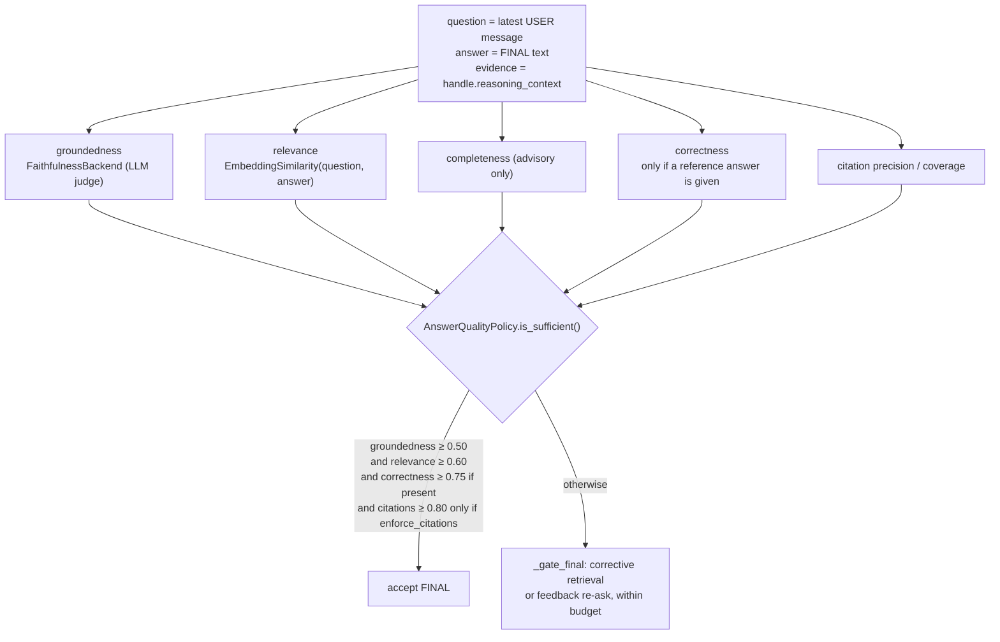

# src/agentic/evaluation/ — Runtime Answer-Quality Gate

Verified against the code on 2026-09-23. Offline RAG evaluation lives in
`src/rag/evaluation/`; this package scores a live agent's FINAL answer.

## Components

| File | Class | Role |
|---|---|---|
| `answer.py` | `AnswerEvaluator` | `evaluate(question, answer, evidence, reference_answer=None, citations=())` runs five scores concurrently (`asyncio.gather`) |
| `answer.py` | `AnswerQualityPolicy` | Thresholds + `is_sufficient()`; empirically calibrated (see its docstring and `scripts/python/calibrate_answer_quality_thresholds.py`) |
| `similarity.py` | `EmbeddingSimilarity` | Cosine similarity over the shared embedding provider |

Wiring: `wiring/factories/executor.py:72-81`. Groundedness uses the
`FaithfulnessBackend` selected by `settings.llm.faithfulness_backend`
(`legacy` default, or `ragas`) from `rag/evaluation/faithfulness_backend.py`,
an LLM-judge call. The other scores are local embedding similarity.

## Flow (called from `AgentContinuationService._gate_final`)

Defaults: `min_groundedness=0.50`, `min_relevance=0.60`,
`min_completeness=0.70` (logged, not blocking), `min_correctness=0.75`,
`min_citation_precision=0.80`, `min_citation_coverage=0.80`,
`enforce_citations=False`.

---

Known architecture and security gaps are tracked privately by the maintainers.
