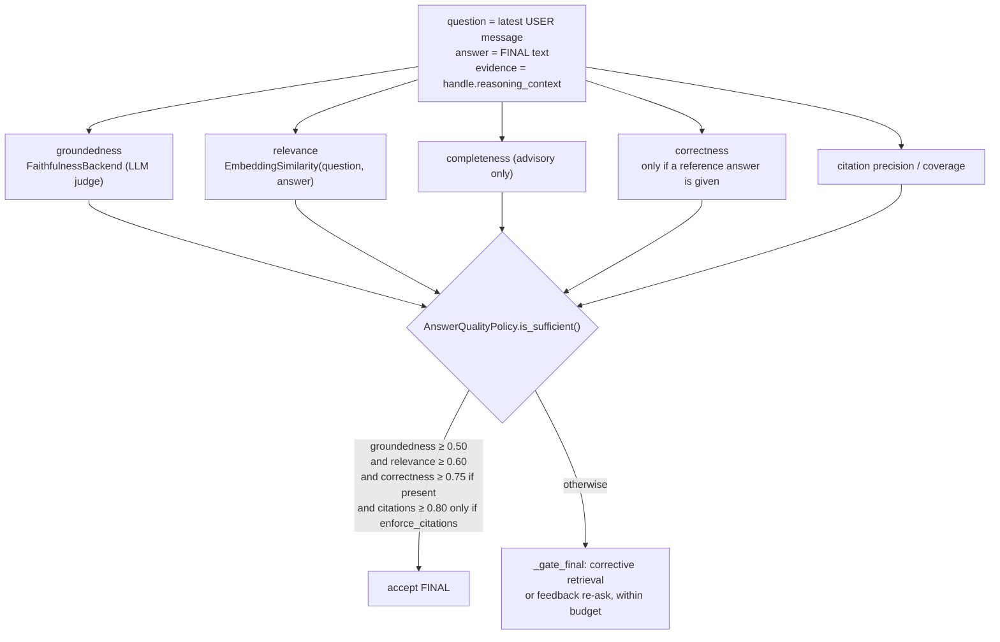

# src/agentic/evaluation/ — Runtime Answer-Quality Gate

Verified against the code on 2026-09-23. Offline RAG evaluation lives in
`src/rag/evaluation/`; this package scores a live agent's FINAL answer.

## Components

| File | Class | Role |
|---|---|---|
| `answer.py` | `AnswerEvaluator` | `evaluate(question, answer, evidence, reference_answer=None, citations=())` runs five scores concurrently (`asyncio.gather`) |
| `answer.py` | `AnswerQualityPolicy` | Thresholds + `is_sufficient()`; empirically calibrated (see its docstring and `scripts/python/calibrate_answer_quality_thresholds.py`) |
| `similarity.py` | `EmbeddingSimilarity` | Cosine similarity over the shared embedding provider |

Wiring: `create_executor()` in `wiring/factories/executor.py`
(`AnswerQualityPolicy(require_evidence=True)`). Groundedness uses the
`FaithfulnessBackend` selected by `settings.llm.faithfulness_backend`
(`legacy` default, or `ragas`) from `rag/evaluation/faithfulness_backend.py`,
an LLM-judge call. The other scores are local embedding similarity.

## Flow (called from `AgentContinuationService._gate_final`)

```mermaid
flowchart TD
    IN["question = latest USER message<br/>answer = FINAL text<br/>evidence = handle.reasoning_context"] --> G["groundedness<br/>FaithfulnessBackend (LLM judge)"]
    IN --> R["relevance<br/>EmbeddingSimilarity(question, answer)"]
    IN --> C["completeness (advisory only)"]
    IN --> K["correctness<br/>only if a reference answer is given"]
    IN --> CI["citation precision / coverage"]
    G & R & C & K & CI --> P{"AnswerQualityPolicy.is_sufficient()"}
    P -->|"groundedness ≥ 0.50<br/>and relevance ≥ 0.60<br/>and correctness ≥ 0.75 if present<br/>and citations ≥ 0.80 only if enforce_citations"| OK[accept FINAL]
    P -->|otherwise| RETRY["_gate_final: corrective retrieval<br/>or feedback re-ask, within budget"]
```

With `require_evidence=True`, an answer with no evidence at all (groundedness
not applicable) is insufficient: `_gate_final` runs one corrective retrieval
and, if that finds nothing, replaces the answer with a fixed "no sources"
message. An answer still insufficient when the budget runs out is replaced
with a fixed "couldn't verify" message. So is one the groundedness judge
couldn't score because its provider was unavailable (a rate limit, timeout,
connection error or 5xx; `GroundednessResult.judge_unavailable`, set through
`core/judge_availability.py`): there is no retry, since the same judge
couldn't check a re-asked answer either. That skip is logged and counted in
`juris_ai_answer_retries_skipped_total{reason}`. An unusable verdict or a low
score is still retried. Both are marked
`AnswerEvaluationSummary.verified=False` (`answer_verified` in the response).

Defaults: `min_groundedness=0.50`, `min_relevance=0.60`,
`min_completeness=0.70` (logged, not blocking), `min_correctness=0.75`,
`min_citation_precision=0.80`, `min_citation_coverage=0.80`,
`enforce_citations=False`.

---

Known architecture and security gaps are tracked privately by the maintainers.
