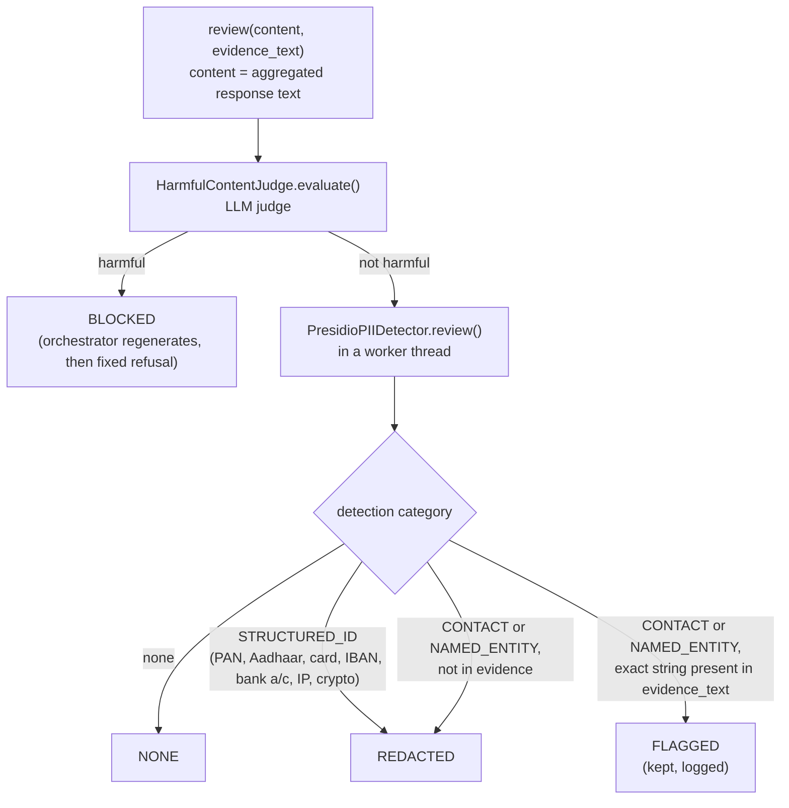

# src/agentic/guardrails/ — Output Guardrails

Verified against the code on 2026-09-23.

## Purpose

`OutputGuardrailService.review()` is the last content check on an
aggregated response: harmful content first, then PII detection/redaction.
It runs once per regenerate attempt in `AIOrchestrator.handle()`/`stream()`
and once in `resume()`.

| File | Class | Role |
|---|---|---|
| `service.py` | `OutputGuardrailService` | Orchestrates the two checks, returns `GuardrailReviewResult` |
| `harmful_content.py` | `HarmfulContentJudge` | LLM judge (cached, temperature 0.0, `JUDGE_MODEL`); unparsable verdict → harmful (fail closed) |
| `pii.py` | `PresidioPIIDetector` | Presidio + spaCy (`GUARDRAIL_SPACY_MODEL`, default `en_core_web_sm`) with custom `IN_PAN`/`IN_AADHAAR` recognizers; structured IDs always REDACTED; contact/named-entity PII FLAGGED when it appears verbatim in the evidence, else REDACTED |
| `schemas.py` | `GuardrailActionEnum` (NONE/FLAGGED/REDACTED/BLOCKED), `PIIDetection`, `HarmfulContentResult`, `GuardrailReviewResult` | |

Settings: `config/guardrails.py` (`GUARDRAIL_MAX_REGENERATE_ATTEMPTS=1`,
i.e. two attempts in total). Wiring: `wiring/factories/guardrails.py`.

## Flow

The final action is the highest severity across detections. Any action
other than NONE is written to the compliance log by the orchestrator.

---

Known architecture and security gaps are tracked privately by the maintainers.
