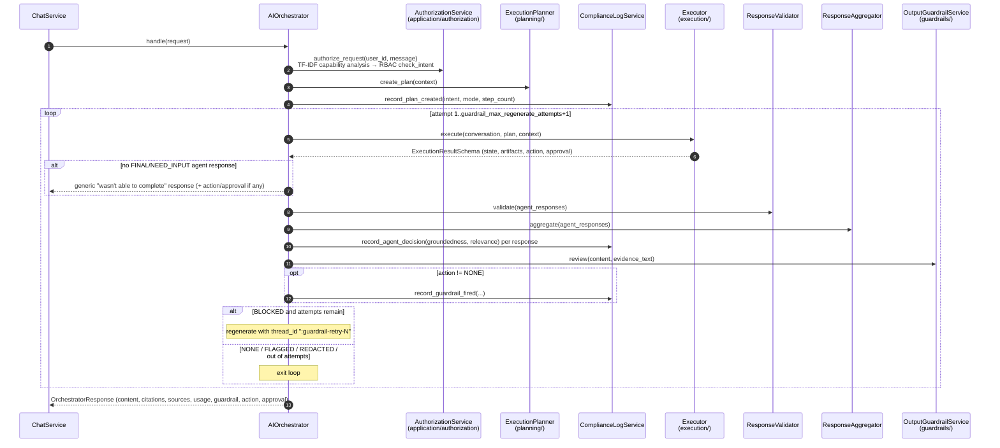

# src/agentic/orchestration/ — Request Lifecycle Coordinator

Verified against the code on 2026-09-23.

## Purpose

`AIOrchestrator` (`orchestrator.py`) owns one chat turn end to end:
authorize → plan → execute → validate → aggregate → guardrail review →
build the response, writing compliance-log events along the way. It
**coordinates and never executes** agents or tools itself; execution is
delegated to `agentic/execution/` (`Executor`), which runs the plan as a
LangGraph graph whose nodes drive `agents/runtime/`.

## Entry points

| Method | Called by | What differs |
|---|---|---|
| `handle(request, action_workflow_service)` | `ChatService.chat()` | Non-streaming; returns one `OrchestratorResponse` |
| `stream(request, action_workflow_service)` | `ChatService.stream_chat()` | Same lifecycle; `Executor.execute_streaming()`; all chunks buffered until the guardrail verdict, then replayed or replaced |
| `resume(...)` | `HitlResumeService` after an approval decision | `Executor.resume()`; single guardrail pass, no regenerate loop |

Schemas: `schemas/request.py` (`OrchestratorRequest`, `Attachment`),
`schemas/context.py` (`OrchestrationContext`), `schemas/response.py`
(`OrchestratorResponse`, `OrchestratorStreamChunk`).

## Request flow (`handle()`)

A final `BLOCKED` verdict returns a fixed refusal instead of the
generated content.

## `stream()` differences

- Each attempt's `AgentStreamChunkDTO`s are **buffered**, never forwarded,
  until the loop resolves, so a discarded attempt never reaches the client.
- NONE/FLAGGED: buffered chunks are replayed, then one empty
  `is_final=True` chunk carries the `OrchestratorResponse`.
- REDACTED/BLOCKED: chunks are dropped and one `is_final=True` chunk
  carries the redacted text or the refusal.

## Notes

- `authorize_request` runs a TF-IDF capability analysis of the message and,
  when capabilities are found, an RBAC intent check
  (`application/authorization/`, policy from
  `application/authorization/rbac/policy.py`).
- When execution returns no FINAL/NEED_INPUT agent response, `handle()`
  returns a fixed fallback message together with any pending
  action/approval.
- The compliance log's `tenant_id` is set to the user id.
