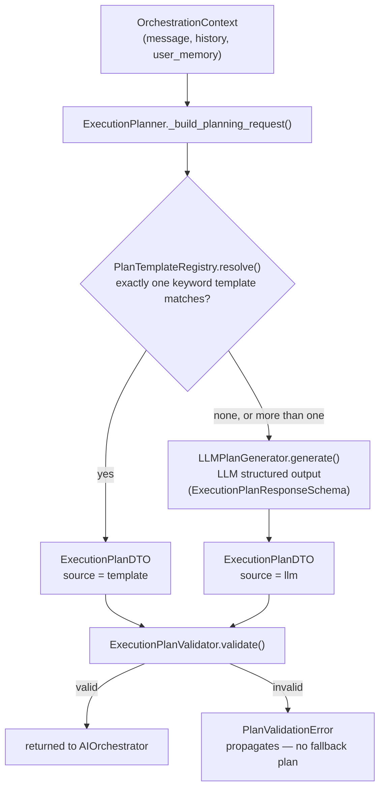

# src/agentic/planning/ — Building the Execution Plan

Verified against the code on 2026-09-23.

## Purpose

Turns the user's message (plus history and saved user memory) into a
validated `ExecutionPlanDTO`: an intent, a descriptive mode, and a list of
steps, each naming one agent (`AgentTypeEnum`), an instruction and its
`depends_on` step ids. `execution/` derives concurrency from `depends_on`;
`mode` is telemetry only.

## Entry points

| Class | File | Role |
|---|---|---|
| `ExecutionPlanner` | `planner.py` | `create_plan(context)`: template first, else LLM; then validate |
| `PlanTemplateRegistry` | `templates.py` | Deterministic plans for contract review, contract analysis, clause extraction, risk analysis, legal research |
| `LLMPlanGenerator` | `llm_planner.py` | `generate_structured(response_model=ExecutionPlanResponseSchema)` at `LLMTask.STRUCTURED_DECISION` (temperature 0.0) |
| `PlanningPromptBuilder` | `prompts/planning.py` + `prompts/templates/planning.md` | System prompt, history, `<user_memory>` block |
| `ExecutionPlanValidator` | `validator.py` | Structural checks; raises `PlanValidationError` |

## Flow

`ExecutionPlanValidator` checks: non-empty steps, unique non-empty step ids,
non-empty instruction, `stage >= 1`, dependencies that exist, aren't
duplicated, self-referencing or cyclic, and no unsafe concurrency (two steps for
the same agent that could run in parallel, `_validate_agent_concurrency`;
see #56), plus mode consistency. An invalid plan raises; there is
deliberately no fallback plan, since a generic plan could change the
request's meaning. Saved user memory is rendered into the planner prompt
as a dedicated block, never as a history message.

---

Known architecture and security gaps are tracked privately by the maintainers.
