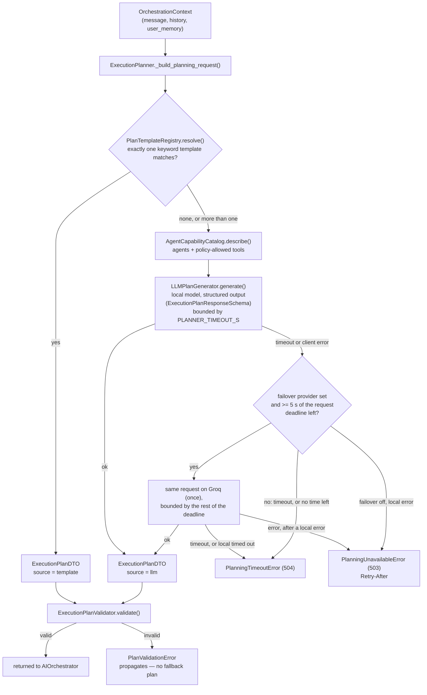

# src/agentic/planning/ — Building the Execution Plan

Verified against the code on 2026-09-23.

## Purpose

Turns the user's message (plus history and saved user memory) into a
validated `ExecutionPlanDTO`: an intent, a descriptive mode, and a list of
steps, each naming one agent (`AgentTypeEnum`), an instruction and its
`depends_on` step ids. `execution/` derives concurrency from `depends_on`;
`mode` is telemetry only.

## Entry points

| Class | File | Role |
|---|---|---|
| `ExecutionPlanner` | `planner.py` | `create_plan(context)`: template first, else LLM; then validate |
| `PlanTemplateRegistry` | `templates.py` | Deterministic plans for contract review, contract analysis, clause extraction, risk analysis, legal research |
| `LLMPlanGenerator` | `llm_planner.py` | Fills `agent_capabilities`, then `generate_structured(response_model=ExecutionPlanResponseSchema)` at `LLMTask.STRUCTURED_DECISION` (temperature 0.0) on the local model, bounded by `PLANNER_TIMEOUT_S` or the request's deadline if sooner. On a timeout or client error it asks the failover client (`PLANNER_FAILOVER_PROVIDER`, Groq by default) once, within the rest of the request's deadline, if at least 5 s of it is left; otherwise, or if either call times out, `PlanningTimeoutError` (504). Both calls failing with a client error is `PlanningUnavailableError` (503, `Retry-After: PLANNER_UNAVAILABLE_RETRY_AFTER_S`). Failover off: a local timeout is 504 and a local error is 503 (`PlanningUnavailableError`) |
| `AgentCapabilityCatalog` | `capabilities.py` | Each plannable agent (`AgentTypeEnum`, registered, with a policy): its metadata description and the tools its `agent_policies` row allows, via `ToolRegistry.describe()`, the same source as the agent's own tool catalog |
| `PlanningPromptBuilder` | `prompts/planning.py` + `prompts/templates/planning.md` + `prompts/agent_capabilities.py` | Instructions, the generated "Available Agents" block (tool names and purposes, no parameter schemas), `<user_memory>` block, history |
| `ExecutionPlanValidator` | `validator.py` | Structural checks; raises `PlanValidationError` |

## Flow

```mermaid
flowchart TD
    CTX["OrchestrationContext<br/>(message, history, user_memory)"] --> REQ["ExecutionPlanner._build_planning_request()"]
    REQ --> TPL{"PlanTemplateRegistry.resolve()<br/>exactly one keyword template matches?"}
    TPL -->|yes| PLAN["ExecutionPlanDTO<br/>source = template"]
    TPL -->|none, or more than one| CAP["AgentCapabilityCatalog.describe()<br/>agents + policy-allowed tools"]
    CAP --> LLM["LLMPlanGenerator.generate()<br/>local model, structured output<br/>(ExecutionPlanResponseSchema)<br/>bounded by PLANNER_TIMEOUT_S"]
    LLM -->|ok| PLAN2["ExecutionPlanDTO<br/>source = llm"]
    LLM -->|timeout or client error| FAILOVER{"failover provider set<br/>and >= 5 s of the request<br/>deadline left?"}
    FAILOVER -->|yes| GROQ["same request on Groq (once),<br/>bounded by the rest of the deadline"]
    GROQ -->|ok| PLAN2
    GROQ -->|timeout, or local timed out| TO["PlanningTimeoutError (504)"]
    GROQ -->|error, after a local error| UNAV["PlanningUnavailableError (503)<br/>Retry-After"]
    FAILOVER -->|"no: timeout, or no time left"| TO
    FAILOVER -->|"failover off, local error"| UNAV
    PLAN --> VAL["ExecutionPlanValidator.validate()"]
    PLAN2 --> VAL
    VAL -->|valid| OUT["returned to AIOrchestrator"]
    VAL -->|invalid| ERR["PlanValidationError<br/>propagates — no fallback plan"]
```

`ExecutionPlanValidator` checks: non-empty steps, unique non-empty step ids,
non-empty instruction, `stage >= 1`, dependencies that exist, aren't
duplicated, self-referencing or cyclic, and no unsafe concurrency (two steps for
the same agent that could run in parallel, `_validate_agent_concurrency`;
see #56), plus mode consistency. Then the step cap: more than
`max_steps` steps (`PLAN_MAX_STEPS`, default 6; the planner prompt states
it too) raises `PlanTooLargeError`, which `AIOrchestrator` answers with a
reply asking the user to split the request, without running anything.
Any other invalid plan raises; there is deliberately no fallback plan
and no truncation, since either could change the request's meaning. Saved user memory is rendered into the planner prompt
as a dedicated block, never as a history message.

The local model is loaded at startup in the background
(`wiring/factories/clients.py` `warm_up_local_llm()`, from `main.py`'s
lifespan; the duration is logged) and kept loaded for `LLM_LOCAL_KEEP_ALIVE`
after each call, so planning rarely meets a cold load. A failover is
counted in `juris_ai_llm_failovers_total{primary="local", fallback="groq"}`.

---

Known architecture and security gaps are tracked privately by the maintainers.
