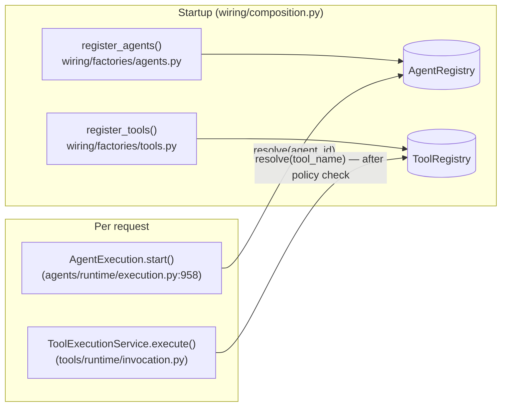

# src/agentic/registry/ — Agent and Tool Registries

Verified against the code on 2026-09-23.

## Purpose

Name → instance lookup for agents and tools, populated once at startup.
No policy logic lives here: permission is checked by `agentic/policy/`
before a tool is resolved.

| File | Class | Role |
|---|---|---|
| `agent.py` | `AgentRegistry` | `register(component)`, `resolve(key)`, `exists`, `keys`; duplicate → `AgentRegistrationError`, missing → `AgentNotFoundError` |
| `tool.py` | `ToolRegistry` | Same shape; duplicate → `ToolRegistrationError`, missing → `ToolNotFoundError` |
| `protocols.py` | `Registry[T]`, `AgentRegistryProtocol`, `ToolRegistryProtocol`, `LLMClientRegistryProtocol` | Structural contracts |

## Flow

## Notes

- `ToolRegistry.resolve()` failures propagate out of
  `ToolExecutionService` (only `tool.execute()` failures become a failed
  `ToolResult`). In practice the policy check rejects unknown names first,
  because `allowed_tools` only lists registered tools.
