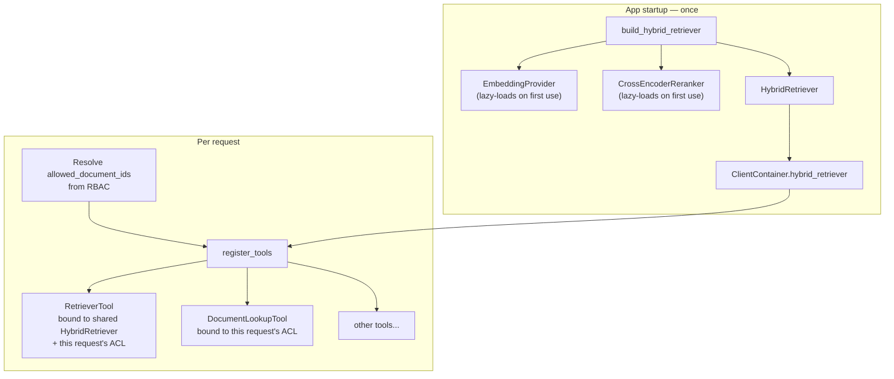
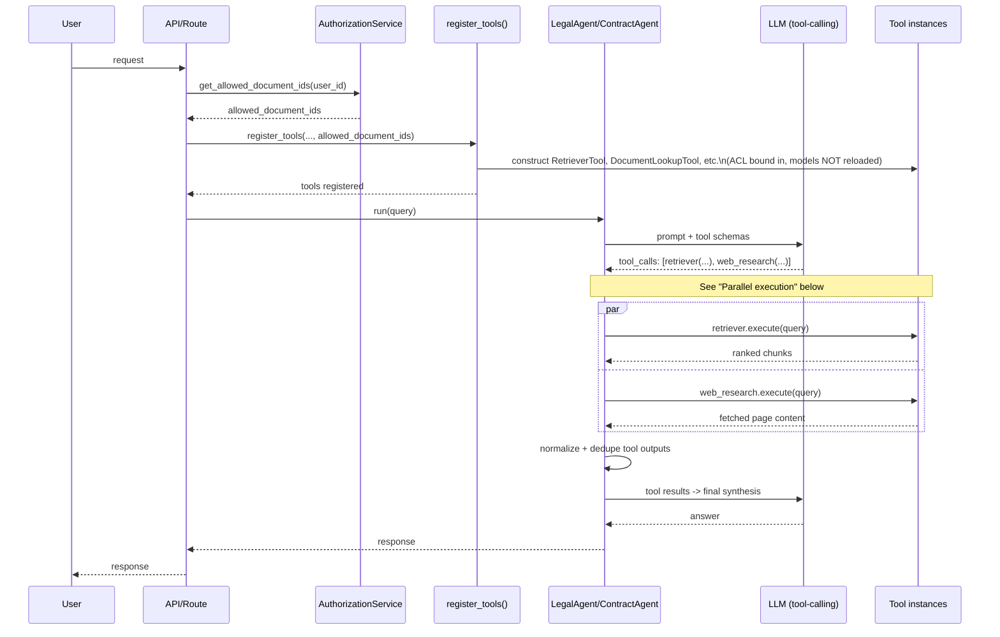

# Juris-AI Tools

## What's here

Seven agent-callable tools, each a thin wrapper (`Tool.execute()`)
around either an in-process capability or an external MCP server.

| Tool | Package | Backing | ACL-scoped? | Side-effecting? |
|---|---|---|---|---|
| `retriever` | `tools/retrieval.py` | `HybridRetriever` (vector + keyword + rerank, in-process) | **Yes** — `allowed_document_ids` bound at construction | No |
| `document_lookup` | `tools/document/document_lookup.py` | `DocumentRepository`, in-process | **Yes** | No |
| `parser` | `tools/document/parser.py` | PDF/DOCX/text parsing, in-process | N/A — operates on files the user uploaded directly | No |
| `case_law_search` | `tools/search_engine/case_law_search.py` | `DocumentRepository` (internal, ACL-scoped) + `WebResearchTool` (external, public) | **Partially** — only the internal-contracts path | No |
| `web_research` | `tools/search_engine/web_research.py` | Self-hosted SearXNG (google/bing/yahoo) + content fetch/extract | No — public web content | No |
| `email` | `tools/messaging/email.py` | Gmail, via MCP | No | **Yes** — `send()` requires an approval token |
| `slack` | `tools/messaging/slack.py` | Slack, via MCP | No | **Yes** — `post()` requires an approval token |

**Everything ACL-scoped is bound at construction, never exposed as an
`execute()` parameter.** A value that restricts what an LLM can see
must not be something the LLM can set, omit, or be prompt-injected
into overriding — see `tools/retrieval.py`'s docstring for the full
reasoning. `factories/tools.py` resolves `allowed_document_ids` once
per request, before any tool is built.

---

## Lifecycle: two different lifetimes in one factory

This is the gap that existed before this pass: `register_tools()` runs
**per request** (it needs a per-request DB session and the requesting
user's permissions) — but `retriever`'s embedding model and reranker
model are **expensive to load** and must not be reloaded every request.

`ClientContainer.hybrid_retriever` is built once in
`factories/rag.py`, called from `factories/clients.py` at startup.
`factories/tools.py` never constructs `EmbeddingProvider` or
`CrossEncoderReranker` — it only wraps the shared instance with
request-specific ACL data.

---

## Request sequence

---

## The orchestration question: parallel calls vs. a dispatcher

**Recommendation: let the LLM's native parallel tool-calling handle
this — don't build a custom MCP-style dispatcher on top of your own
in-process tools.**

Reasoning:

- Groq's (and most modern providers') tool-calling API can already
  return multiple `tool_calls` in a single assistant turn when the
  model decides several tools are needed. LangGraph's tool-execution
  node runs whatever calls come back — executing them concurrently
  (`asyncio.gather`) is the only change needed, not a new routing
  layer. A dispatcher that re-decides "which tool to call" duplicates
  exactly what tool-calling already does.
- **The one place a dispatcher genuinely earned its keep is
  `SearchRouter`** (`search_legal`, from earlier in this project) —
  and the reason is specific: `web_search`, `news_search`, and
  `legal_search` were **interchangeable alternatives for the same
  job** (find information on the web), so collapsing them behind one
  decision point reduced the LLM's chance of picking the wrong one
  and reduced redundant calls. `retriever`, `document_lookup`,
  `case_law_search`, and `web_research` are **not** interchangeable —
  they do fundamentally different things (internal vector search,
  internal exact lookup, external case law, external general web).
  Forcing them behind one dispatcher would just be an extra
  indirection layer with no consolidation benefit.
- **The deciding heuristic**: dispatch/consolidate when tools are
  *substitutes* for each other; expose separately and let native
  parallel tool-calling handle it when tools are *complements* doing
  different jobs.

**What still needs building — normalization/dedup after parallel
calls**, which is a real gap right now: if `retriever` and
`web_research` both return overlapping content (e.g. a contract
clause quoted both in an internal chunk and in a web article
discussing it), nothing currently collapses that duplication before
it reaches the final LLM call. The right home for this is your
existing `execution/aggregation/response.py`
(`ResponseAggregator`) or `execution/state/assembler.py` — both
already exist in your tree for exactly this kind of "combine multiple
tool outputs into one context" responsibility. Don't add a new module
for it.

This is the natural next step — want to build the dedup/normalization
pass into one of those two existing modules next?
