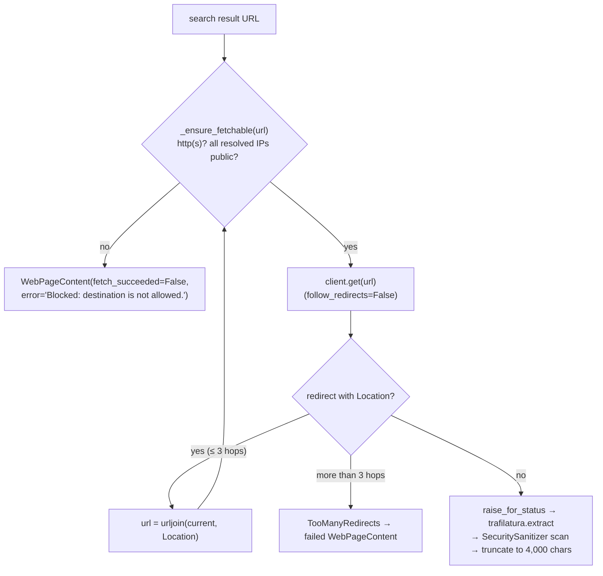

# Juris-AI Tools

Verified against the code on 2026-09-23.

## What's here

Seven agent-callable tools. Each subclasses `Tool` (`tools/base.py`) and
exposes `async execute(**kwargs) -> str`. An agent can only call a tool
that its `agent_policies` row allows.

| Tool (`name`) | Module | Backing | Access scoping | Default policy |
|---|---|---|---|---|
| `retriever` | `tools/retrieval.py` | `HybridRetriever` (pgvector + keyword, RRF, cross-encoder rerank) | None needed: the index holds only the shared legal corpus loaded by offline ingestion; user files are never indexed | legal, contract |
| `case_law_search` | `tools/search_engine/case_law_search.py` | `KnowledgeSourceRepository` search (shared corpus) + `WebResearchTool` | Shared corpus / public web | legal |
| `web_research` | `tools/search_engine/web_research.py` | Self-hosted **SearXNG** (`SearxngClient`) + `ContentFetcher` (httpx + trafilatura) | Public web | legal, only when enabled by settings (`wiring/factories/agent_policies.py`) |
| `library_lookup` | `tools/library/file_lookup.py` (`LibraryLookupTool`) | `LibraryRepository` via a session factory | Per-user: reads `allowed_library_ids` from the request context at execute-time; fails closed if it was never resolved | contract |
| `parser` | `tools/library/parser.py` | PDF/DOCX/text/Markdown parsing in a worker thread | Operates only on the `files: list[ToolFileDTO]` passed to `execute()` | contract |
| `email` | `tools/messaging/email.py` | Gmail via MCP | — | none |
| `slack` | `tools/messaging/slack.py` | Slack via MCP | — | none |

Notes:
- **`email` / `slack`:** reads go through MCP; sending is designed to go
  through `send()` / `post()` with an approval token. Every call to either
  tool is routed through human approval (`GATED_TOOLS`).
- A `BraveClient` exists in `adapters/clients/search_engine/brave.py`
  but isn't wired in; `web_research` uses SearXNG.

**Access scoping is never an `execute()` parameter.** Values that restrict
what an LLM can see (e.g. `allowed_library_ids`) come from the server-side
request context (`application/context/request.py`, set by
`api/dependencies/authorization.py:bind_library_acl`), so the model can't
set, omit or be prompt-injected into overriding them.

## Lifetime

`register_tools()` (`wiring/factories/tools.py`) runs **once at startup**;
every tool is a process-lifetime singleton registered in the
`ToolRegistry`. Per-request state never lives on a tool: DB access goes
through a session *factory* opened per call, and ACLs are read from the
request context at execute-time. The embedding model and reranker are
built once in `wiring/factories/rag.py` and shared through
`ClientContainer.hybrid_retriever`.

## Call path

```mermaid
sequenceDiagram
    participant RT as Agent runtime (agents/runtime/execution.py)
    participant PG as AgentPolicyGuard
    participant CS as AgentContinuationService
    participant TES as ToolExecutionService (tools/runtime/invocation.py)
    participant T as Tool
    participant RC as ToolResultConverter

    RT->>RT: LLM decision = TOOL_CALL(tool_name, parameters)
    RT->>PG: check_tool(agent policy)
    alt tool_name in GATED_TOOLS (email, slack)
        RT->>CS: action_type = SEND
        CS->>CS: interrupt() -> approval (decided only by the requesting user);<br/>on approve, Executor.resume() runs the tool
    else any other tool
        CS->>TES: execute(tool_name, parameters) inside a LangGraph @task (replay-safe)
        TES->>T: registry.resolve(tool_name).execute(**parameters)
        T-->>TES: str
        TES-->>CS: ToolResult
    end
    CS->>RC: ToolResult -> RetrievedContentDTO
    CS->>RT: extend_reasoning_context(...) -> next reasoning iteration
```

The runtime makes **one TOOL_CALL decision per reasoning iteration**,
bounded by `AgentExecutionBudget` (`max_tool_calls=20`, `max_iterations=10`,
repeated-action and no-progress limits). Tool output re-enters the next
prompt through `BasePromptBuilder.build_context()`, wrapped in
`<retrieved_context>` delimiters as untrusted content; any delimiter tag
inside the tool output is escaped first, so it stays inside the wrapper.

## Untrusted content

`ContentFetcher`, `ParserTool` and `WebResearchTool` screen fetched pages,
uploaded files and page titles with `rag.ingestion.sanitizer.SecuritySanitizer`
prompt-injection patterns, and replace a match with a "content withheld"
marker.

`ContentFetcher` uses a shared `httpx.AsyncClient` (8 s timeout, up to 5
concurrent fetches, 4,000 characters per page) that does not follow
redirects itself. `ContentFetcher._get()` follows at most 3 redirects and
validates every destination before requesting it (`_ensure_fetchable()`):
the scheme must be `http`/`https`, and every address the host resolves to
must be globally routable (loopback, private, link-local, reserved,
shared, unspecified and multicast addresses are refused; IPv4-mapped IPv6
is checked as IPv4). A refused destination yields a failed
`WebPageContent` with a generic error and no request to that address.



---

Known architecture and security gaps are tracked privately by the maintainers.
