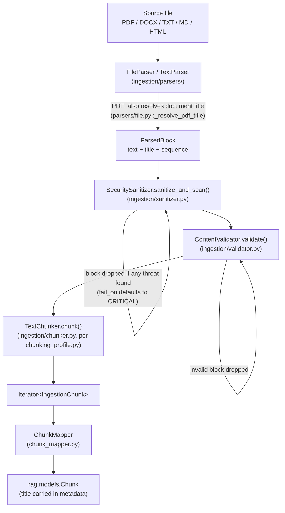
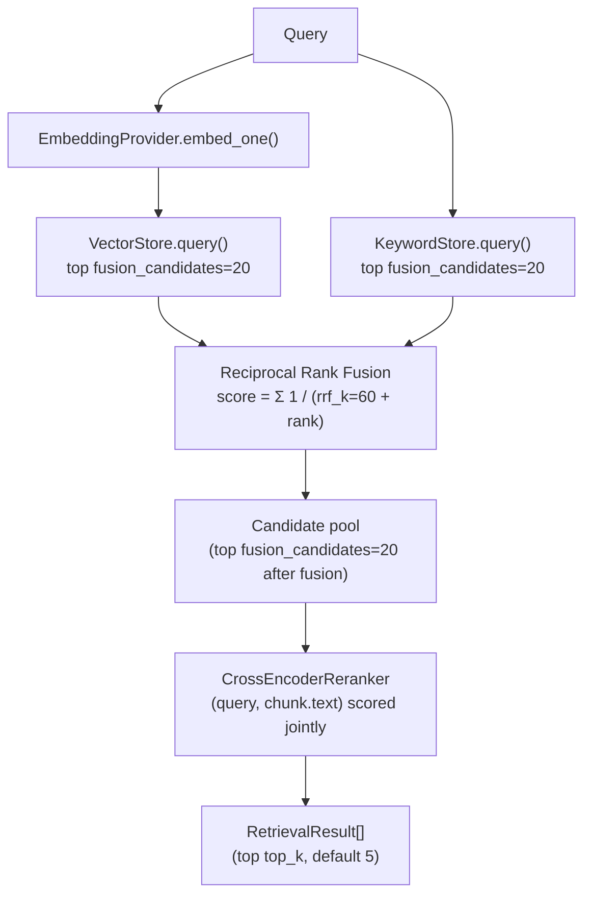
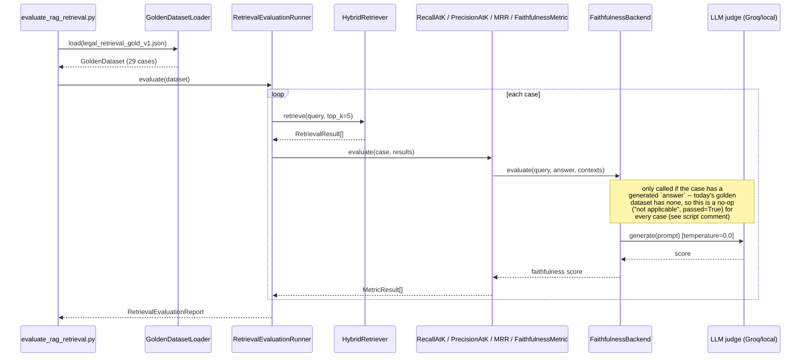

# Juris-AI RAG Pipeline

## Purpose

`rag/` owns the **RAG data plane**: turning the legal-document corpus
into searchable representations and retrieving relevant chunks for
agents. It is intentionally separate from the agent/LLM intelligence
plane (`src/agentic/`) — RAG does not execute agents, orchestrate the
LLM, or manage conversation state.

## Module map

| Path | Responsibility |
|---|---|
| `models.py` | Canonical RAG domain models (`Chunk`, `EmbeddingRepresentation`, `RetrievalResult`) |
| `embeddings.py` | Concrete embedding-provider implementation (`SentenceTransformerEmbeddingProvider`, `BAAI/bge-small-en-v1.5`) |
| `indexer.py` | Chunk -> embedding -> vector/keyword index orchestration |
| `chunk_mapper.py` | Maps ingestion-layer `IngestionChunk` into the RAG-domain `Chunk` (deterministic chunk IDs, hashed from `source_id`+`sequence`) |
| `hybrid_retriever.py` | Vector + keyword retrieval, RRF fusion, cross-encoder reranking |
| `pgvector_store.py` | PostgreSQL/pgvector adapter (`VectorStoreProtocol`) |
| `keyword_store.py` | PostgreSQL full-text-search adapter (`KeywordStoreProtocol`) |
| `reranker.py` | Cross-encoder second-stage reranker |
| `protocols/` | Capability contracts (`embedding_provider`, `vector_store`/`vector`, `keyword`, `reranker`, `indexer`, `index_persistence`, `document_ingestion`) |
| `ingestion/` | Document preprocessing: parse -> sanitize -> validate -> chunk (see below) |
| `evaluation/` | Golden-dataset retrieval evaluation, RAGAS/legacy faithfulness scoring, online sampling |

Concrete adapters are injected against the protocols — swap a provider
by implementing the protocol, not by changing call sites.

## Ingestion pipeline

Real, confirmed order (`ingestion/pipeline.py::_validated_blocks()`):
parse -> sanitize -> validate -> chunk. The pipeline is a lazy
generator — it never holds a whole document or a full chunk list in
memory.

- **Title extraction** happens once, at parse time, only for PDFs
  today (`parsers/file.py::_resolve_pdf_title()` — prefers embedded
  PDF metadata, falls back to filename). It survives through
  `ParsedBlock.title` -> chunking -> `ChunkMapper` into `Chunk`'s
  metadata dict. The `url` key is reserved for web-sourced documents;
  the current ingestion path is file-based.
- **Injection screening** happens immediately after parsing, before
  validation or chunking — `SecuritySanitizer.sanitize_and_scan()`
  drops the whole block on any detected threat at ingestion time. This
  is a stricter default than the two other call sites that reuse the
  same sanitizer (`agentic/tools/search_engine/content_fetch.py` and
  `agentic/tools/library/parser.py` withhold only on `CRITICAL`,
  since those paths would rather show degraded content than silently
  drop a user's uploaded file or a whole search result).

Offline entry point: `ingestion/ingest_offline.py`, run via
`scripts/bash/ingest_offline.sh <source-directory>`. Persistence of the
resulting chunks/embeddings is owned by
`application/services/knowledge_chunk_indexing.py` +
`rag_index_persistence.py` — indexing *logic* stays in `rag/`,
persistence *orchestration* stays in `application/`.

## Retrieval pipeline

`HybridRetriever.retrieve()` (`hybrid_retriever.py`) runs vector and
keyword search concurrently once the query embedding is computed, then
fuses with RRF before reranking. Constants (both overridable per call,
shown at their defaults):

- `DEFAULT_RRF_K = 60` (`rag_rrf_k` in settings) — RRF's smoothing
  constant; higher values flatten the influence of rank differences.
- `DEFAULT_FUSION_CANDIDATES = 20` — how many results each of
  vector/keyword search contributes *before* fusion, and the size of
  the pool handed to the reranker after fusion.
- `top_k` (caller-supplied, default 5 in the evaluation script) — the
  final result count returned after reranking.

Vector and keyword retrieval are otherwise independent: keyword
scoring doesn't know about vector similarity or vice versa; RRF is
what lets a chunk supported by both rankings outrank one supported by
only one.

## Evaluation

Run it: `PYTHONPATH=src python scripts/python/evaluate_rag_retrieval.py`.
Other entry points: `scripts/python/compare_rag_retrieval.py` (compare two
configurations), `scripts/python/evaluate_rag_retrieval_comparison.py`.

**Live result, captured 2026-09-13** against the indexed IT Act 2000
corpus (170 chunks): **22/29 cases passed (75.86% pass rate)**,
`recall@5=0.759`, `precision@5=0.152`, `mrr=0.602`. `faithfulness=0.0`
is expected, not a failure — see the note above. 7 failing cases share
one pattern: `recall@5`/`precision@5`/`mrr` all `0.0` (expected
evidence never retrieved in the top 5) — worth a closer look before
trusting retrieval quality on those queries specifically.

### `faithfulness_backend` setting

`settings.llm.faithfulness_backend: Literal["legacy", "ragas"]`
(env var: `faithfulness_backend`, lowercase — this one field breaks
the repo's usual ALL_CAPS env var convention, confirmed in
`config/llm.py`) is the single switch between:

- `"legacy"` (default) — the hand-rolled judge,
  `RAGEvaluator.faithfulness()` (`evaluation/evaluator.py`), wrapped
  by `LegacyFaithfulnessBackend`.
- `"ragas"` — the `ragas` library's own `Faithfulness` metric
  (`evaluation/ragas_faithfulness.py`), wrapped by
  `RagasFaithfulnessBackend`, bridged onto this project's `Judge`
  callable via `ragas_llm_adapter.py`.

`wiring/factories/evaluation.py::build_faithfulness_backend()` is the
*only* place this decision is made — both `FaithfulnessMetric`
(offline evaluation) and `OnlineEvalSampler` (live-traffic sampling)
get their backend from this one factory, so flipping the setting
changes both at once. The underlying judge LLM call
(`build_llm_judge()`) is pinned to `temperature=0.0` regardless of
which backend wraps it — see `src/agentic/README.md`'s determinism
section for why.

If using `"ragas"`, set `RAGAS_DO_NOT_TRACK=true` to opt out of the
`ragas` package's own telemetry (a real env var read by `ragas`
itself, not by this codebase — see `env.example`).

## Error handling

RAG components raise from the exception hierarchy in
`core.exceptions.rag`. Unexpected failures are logged with a stack
trace and wrapped, preserving the original as `__cause__`. Never log
document secrets, credentials, tokens, or sensitive document snippets
— prefer operational metadata (`source_id`, chunk count, `top_k`,
model name, candidate count).

---

Known architecture and security gaps are tracked privately by the maintainers.
