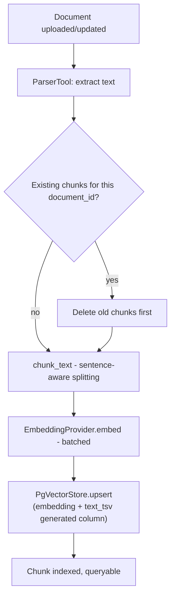
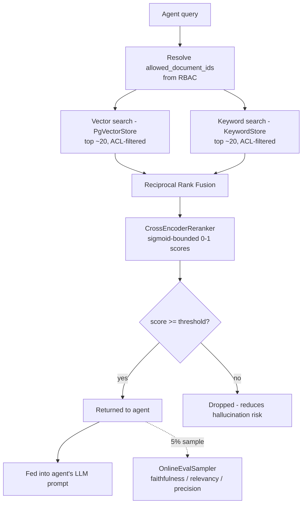

# Juris-AI RAG Pipeline

## What this is

Retrieval-augmented generation over Juris-AI's stored contracts and
legal documents. An agent asks a question; this pipeline finds the
most relevant passages and hands them to the LLM as grounding context.

Two design decisions define this pipeline, both chosen because
pure-vector RAG has well-known failure modes that matter specifically
for legal text:

1. **Hybrid search (vector + keyword), fused with Reciprocal Rank
   Fusion** — not vector search alone.
2. **Cross-encoder reranking** as a second stage after fusion.

Everything else (chunking, ACL enforcement, evaluation) exists to
support those two decisions working correctly in production.

---

## Why hybrid search, not just vector search

Dense embeddings are good at semantic similarity — "indemnification
obligations" retrieves "party shall hold harmless" even with no
shared words. But legal text leans heavily on **exact tokens** that
dense embeddings routinely blur: section numbers ("Section 73"),
defined terms ("Force Majeure", capitalized and specific), case
citations, party names. A query for "Section 73 remedies" can retrieve
semantically-similar-but-wrong sections if nothing enforces the exact
match.

Postgres full-text search (`tsvector`/`ts_rank`) catches exactly this
case, cheaply, reusing infrastructure Juris-AI already runs — no new
service (no Elasticsearch/OpenSearch) for one capability.

**Reciprocal Rank Fusion (RRF)** combines the two ranked lists without
either one "winning" outright:

```
score(chunk) = Σ  1 / (k + rank_in_list)
```

A chunk ranked #2 by vector search and #5 by keyword search scores
higher than one ranked #1 by vector alone but absent from keyword
results — it has two independent signals agreeing it's relevant,
which is a stronger position than one signal being very confident.

## Why rerank after fusion

Cross-encoders (a model that reads the query and a candidate chunk
*together*, not as separately-embedded vectors) are meaningfully more
accurate than embedding similarity — but too slow to run over an
entire corpus. The pattern: **retrieve broad and cheap** (vector +
keyword, ~20 candidates), **rerank narrow and accurate** (cross-encoder
over just those 20, return top 5). This is the standard two-stage
retrieval pattern used in production search systems generally, applied
here with `BAAI/bge-reranker-base` — same model family as the
embedding model, local, no added API cost.

---

## Ingestion pipeline



Key points:
- **Delete-before-reindex** — updating a document without this leaves
  stale chunks from the old version returned alongside the new ones
  forever. This was missing in the original implementation.
- **Sentence-aware chunking** — splits on sentence boundaries, not
  raw character counts, so a chunk never cuts a clause mid-word
  ("...subject to Section 14.2 of th|is Agreement..."). Falls back to
  hard splitting only for pathological input (one sentence longer
  than the chunk size).
- **Embedding model recorded per chunk** — if the embedding model is
  ever swapped, old and new vectors are distinguishable instead of
  silently mixed in the same similarity space.

## Query / retrieval pipeline



**ACL enforcement happens inside the retrieval layer itself**
(`allowed_document_ids` passed to both `PgVectorStore.query` and
`KeywordStore.search`), not only at the agent/tool authorization
layer. This is deliberate belt-and-suspenders: even if some other
component's permission check were missed, a document a user isn't
authorized to see cannot come back through this path. For a platform
storing client contracts across matters/tenants, this is not optional
— it's the difference between a bug and a confidentiality breach.

---

## Evaluation

Standard RAGAS-terminology metrics, computed at two different rigor
levels for two different purposes:

| Metric | What it measures | Needs ground truth? | Where computed |
|---|---|---|---|
| **Faithfulness** | Does the answer only state claims the retrieved context actually supports? (hallucination check) | No | Online (sampled) + offline |
| **Answer Relevancy** | Does the answer address the question asked? | No | Online (sampled) + offline |
| **Context Precision** | Of the retrieved chunks, how many were actually relevant? (retrieval noise) | No | Online (sampled) + offline |
| **Context Recall** | Of the information needed to answer, how much was actually retrieved? (retrieval completeness) | **Yes** | Offline only |

**Online (`rag/evaluation/online_sampler.py`)**: samples ~5% of
production requests, runs the three ground-truth-free metrics using
the **local LLM as judge** — this is the same "low-priority,
non-authorization task → local model" bucket as planner routing and
search classification elsewhere in this project. Fire-and-forget,
after the response is already returned — never adds request latency.
Feeds dashboards/alerting; a dip in faithfulness is an early warning
of a bad reranker threshold, a stale index, or a prompt regression.

**Offline (`rag/evaluation/ragas_offline.py`)**: runs against a
curated golden dataset (question, ground truth, contexts, answer)
using the `ragas` library — more rigorous metric implementations,
justified since this runs infrequently (CI, before shipping a
retrieval-pipeline change) rather than per-request. This is what
actually catches a regression before it ships — online sampling alone
has no ground truth to compare against, so a change that quietly
returns to a *wrong-but-still-plausible-sounding* answer would never
trip online metrics but would show up as a `context_recall` drop
against the golden set.

---

## Edge cases handled

| Edge case | Handling |
|---|---|
| Document updated | `index_document(..., replace_existing=True)` deletes prior chunks first |
| Document deleted | `VectorIndexer.remove_document()` — call this from the document deletion path |
| Empty/whitespace-only document | Guarded in `index_document`, logged, returns 0 chunks, no crash |
| Single sentence longer than chunk_size | `chunk_text` falls back to hard character splitting for that sentence only |
| Embedding model swapped later | `embedding_model` recorded per chunk — detectable, not silently mixed |
| Large document (many chunks) | `EmbeddingProvider.embed` batches internally (`_MAX_BATCH_SIZE`), avoiding OOM |
| Embedding/DB call fails | Wrapped in `RAGError` subclasses, logged, propagated as a clean exception rather than a raw stack trace reaching the agent |
| User queries a document they can't access | `allowed_document_ids` filters at the SQL layer in both stores — zero rows possible, not just fewer |
| Caller passes an empty allowed-document set | Short-circuits to `[]` rather than running a query that would (correctly but wastefully) return nothing |
| No relevant results exist | Reranker threshold drops low-relevance matches rather than always returning top-k regardless of quality — reduces the "confidently wrong" failure mode |
| Reranker/embedding model fails to load | Raises `RerankError`/`EmbeddingError` with a clear message instead of an opaque import/attribute error deep in a request |
| Cross-encoder scores misinterpreted as probabilities | Explicit `Sigmoid()` activation applied — raw logits are unbounded and would make any fixed threshold meaningless |
| Table name interpolated into raw SQL | Validated against a strict identifier pattern at construction time |

---

## Talking points (why these choices, if asked in review)

- **"Why not just use LangChain's retriever?"** — Same reasoning as
  the rest of this project: plain code over framework abstraction
  where correctness/auditability matters. The pipeline here is ~5
  small classes, each independently testable, no hidden retry/prompt
  behavior to reverse-engineer when something goes wrong.
- **"Why Postgres full-text search instead of Elasticsearch?"** —
  Scale-appropriate. Adding a second search infrastructure component
  is only justified once Postgres FTS actually becomes a bottleneck,
  not preemptively. Same `VectorStore`/`KeywordStore` protocol
  boundary makes swapping later a contained change.
- **"Why RRF instead of just weighting the two scores?"** — Vector
  cosine similarity and `ts_rank` are not on comparable scales; RRF
  operates on *rank*, not raw score, so no manual weight-tuning is
  needed and it doesn't silently break if one scorer's score
  distribution shifts.
- **"How do you know retrieval quality doesn't silently degrade?"** —
  Two-tier evaluation: online sampling catches production drift in
  near-real-time (faithfulness/relevancy/precision), offline `ragas`
  evaluation against a golden set is a CI gate for any pipeline
  change, using `context_recall` specifically because it's the one
  metric online sampling structurally cannot compute (no ground
  truth in production).
- **"What's the biggest remaining risk?"** — The reranker threshold
  (`0.3` default) is a guess, not yet tuned against real query
  traffic — this is exactly what the offline golden dataset should be
  used to calibrate before this ships to production, and what
  `has_quality_concern()` alerting should validate isn't drifting
  after.
