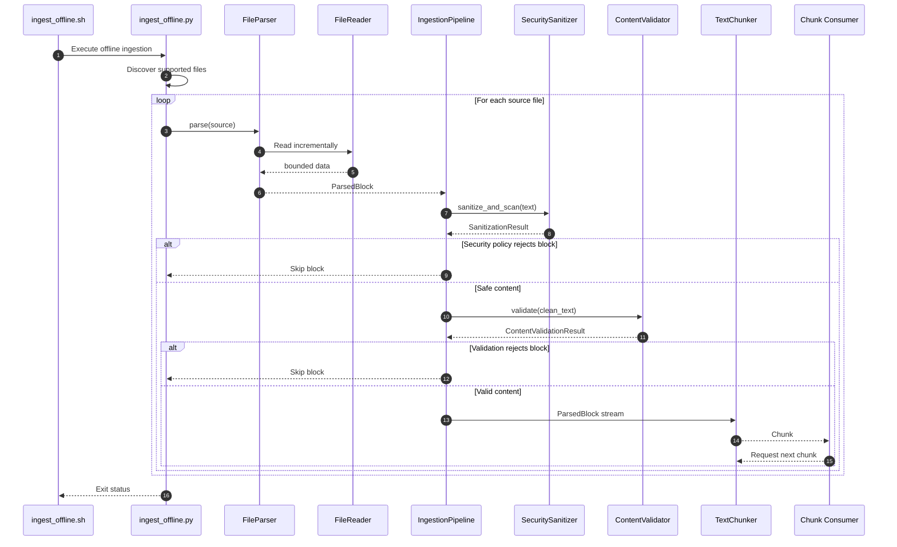

# RAG Ingestion

The `rag/ingestion` package contains the offline document-ingestion
preprocessing flow for Juris-AI.

Its purpose is to transform local legal source documents into validated,
security-screened, semantically useful `Chunk` objects that can later be
consumed by embedding and vector-indexing stages.

## Directory Structure

```text
rag/
└── ingestion/
    ├── __init__.py
    ├── exceptions.py
    ├── models.py
    ├── pipeline.py
    ├── sanitizer.py
    ├── validator.py
    ├── text_chunker.py
    ├── ingest_offline.py
    │
    ├── readers/
    │   ├── __init__.py
    │   └── file_reader.py
    │
    └── parsers/
        ├── __init__.py
        ├── protocol.py
        ├── file_parser.py
        └── text_parser.py
```

| Component | Responsibility |
|---|---|
| `ingest_offline.py` | Offline ingestion entry point and source-file discovery |
| `pipeline.py` | Parser → sanitizer → validator → chunker orchestration |
| `models.py` | `ParsedBlock`, `Chunk`, and related immutable models |
| `exceptions.py` | Ingestion-specific exception hierarchy |
| `sanitizer.py` | Unicode cleanup and security/threat detection |
| `validator.py` | Content validation before chunking |
| `text_chunker.py` | Streaming sentence-aware chunk generation |
| `parsers/protocol.py` | Generic parser contract |
| `parsers/file_parser.py` | File-type detection and document extraction |
| `parsers/text_parser.py` | Parser for already-available text |
| `readers/file_reader.py` | Bounded binary/text file reading |

## Ingestion Flow

```text
                    OFFLINE INGESTION
                           │
                           ▼
                 ┌───────────────────┐
                 │  Source Directory │
                 │   Legal Documents │
                 └─────────┬─────────┘
                           │
                           ▼
                 ┌───────────────────┐
                 │ ingest_offline.py │
                 │   File Discovery  │
                 └─────────┬─────────┘
                           │
                    one Path at a time
                           │
                           ▼
                 ┌───────────────────┐
                 │    FileParser     │
                 └─────────┬─────────┘
                           │
                    ParsedBlock
                           │
                           ▼
                 ┌───────────────────┐
                 │ SecuritySanitizer │
                 └─────────┬─────────┘
                           │
                     clean text
                           │
                           ▼
                 ┌───────────────────┐
                 │ ContentValidator  │
                 └─────────┬─────────┘
                           │
                  validated ParsedBlock
                           │
                           ▼
                 ┌───────────────────┐
                 │    TextChunker    │
                 └─────────┬─────────┘
                           │
                         Chunk
                           │
                           ▼
                 ┌───────────────────┐
                 │ Downstream Stage  │
                 │ Embedding / Index │
                 └───────────────────┘
```

## Sequence Diagram



## Streaming and Memory Model

The pipeline processes data lazily:

```text
Document
   │
   ├── Block 1 → sanitize → validate → chunk → consume
   ├── Block 2 → sanitize → validate → chunk → consume
   ├── Block 3 → sanitize → validate → chunk → consume
   └── ...
```

Do not accumulate document-sized collections:

```python
blocks = list(parser.parse(...))
chunks = list(pipeline.ingest(...))
```

Consume the stream instead:

```python
for chunk in pipeline.ingest(source=source):
    consume(chunk)
```

The intended contract is:

```text
Source → Iterator[ParsedBlock] → Iterator[Chunk]
```

## File Reading

`FileReader` owns low-level file reading only.

It provides bounded:

- `read_bytes()`
- `read_text()`

Text reading uses an incremental decoder so multi-byte characters split
across byte boundaries are handled correctly.

Resources are managed through the generic `ResourceContextManager`.
Explicit `del reader` or `del document` is not used as resource management.

## Parsing

`FileParser` detects the source format and yields `ParsedBlock` objects.

Supported formats:

```text
.pdf
.docx
.txt
.md
.html
.htm
```

The parser avoids constructing an additional complete extracted-document
representation where the underlying parser permits streaming.

## Security Sanitization

`SecuritySanitizer` runs before validation and chunking.

It performs deterministic text cleanup and scans for security-related
content, including:

```text
Unicode/control-character issues
SQL injection heuristics
prompt injection
role/delimiter hijacking
credential/secret patterns
```

Blocks violating the configured security policy are rejected before
chunking.

Sensitive matched content must not be written to logs.

## Content Validation

`ContentValidator` checks the sanitized text for:

- empty content
- insufficient content
- insufficient alphanumeric signal
- invalid Unicode / lone surrogates
- excessive Unicode replacement characters

Validation does not mutate the text.

## Text Chunking

`TextChunker` consumes `ParsedBlock` objects and yields immutable `Chunk`
objects.

It:

- prefers sentence boundaries
- enforces configured chunk size
- supports bounded overlap
- hard-splits unusually long sentences
- keeps document-specific processing state inside the generator
- does not accumulate the complete document

## Thread Safety

Components are designed to avoid shared mutable document state.

Processing state belongs to each generator invocation:

```text
Thread A                         Thread B
────────                         ────────
ingest(file_a)                   ingest(file_b)
    │                                │
    ▼                                ▼
local generator state             local generator state
    │                                │
    ▼                                ▼
chunks A                          chunks B
```

Thread-safe component design does not make third-party parser libraries
automatically thread-safe; resource ownership must remain correctly scoped.

## Error Handling

Use the ingestion-specific exception hierarchy from:

```text
rag/ingestion/exceptions.py
```

Unexpected failures should be logged with stack traces and wrapped at the
appropriate ingestion boundary.

Operational rejection events should log metadata such as source, sequence,
stage, and error type without logging full document content, credentials,
tokens, or sensitive snippets.

## Offline Execution

The Python entry point is:

```bash
python -m rag.ingestion.ingest_offline <source-directory>
```

The preferred shell interface is:

```bash
./scripts/ingest_offline.sh <source-directory>
```

The shell script is only a launcher and contains no ingestion business logic.

## Current Scope

```text
Discovery
   ↓
File Reading
   ↓
Parsing
   ↓
Security Sanitization
   ↓
Content Validation
   ↓
Streaming Chunking
```

The following are intentionally deferred:

```text
Celery
Multiprocessing
Distributed ingestion
Embedding generation
Vector database persistence
BM25/index persistence
Batch scheduling
Retry orchestration
```

These should be added downstream without changing the core streaming
preprocessing contract.

## Design Principle

The ingestion package is:

**bounded-memory + lazy + composable + observable + security-first.**
